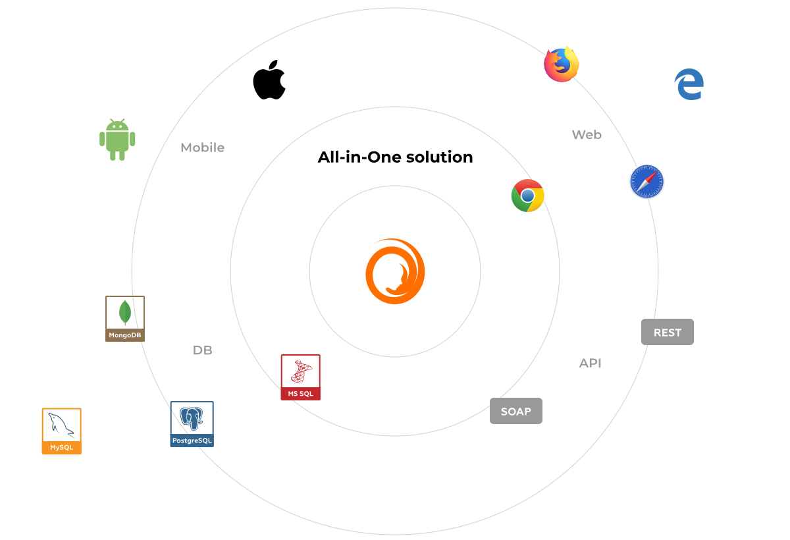

Carina Automation Framework
==================
Carina is a Java-based test automation framework that unites all testing layers: Mobile applications (web, native, hybrid), WEB applications, REST services, Databases.

* Carina framework is built on top of most popular open-source solutions like Selenium, Appium, TestNG allowing to reduce dependence on specific technology stack.

* Carina supports all popular browsers (IE, Safari, Chrome, Firefox) and mobile devices (iOS/Android). Special feature for mobile domain: it reuses test automation code between IOS/Android up to 70-80%.

* As far as our framework is built in Java, it is cross-platform. Tests may be easily executed both on Unix or Windows OS. All you need is JDK 8 installed.

* Framework supports different types of databases - both relational and nonrelational (MySQL, SQL Server, Oracle, PostgreSQL), providing amazing experience of DAO layer implementation using MyBatis ORM framework.

* API testing is based on Freemarker template engine. It enables great flexibility in generating REST requests and responses are dynamically changed by incoming arguments. 

<B>[TRY DEMO PROJECT NOW](https://github.com/qaprosoft/carina-demo)</B>
<B>[READ DOCUMENTATION](http://qaprosoft.github.io/carina)</B>

## Git configuration 
1). **Fork repository** `https://github.com/qaprosoft/carina` to your own user.

2). **Clone your fork to your local machine**:

 `git clone git@github.com:your_fork_url/carina.git`

3). `git remote add origin <your_fork_url>` (can be already added)

4). `git fetch origin`

5). `git remote add upstream git@github.com:qaprosoft/carina.git`

6). `git fetch upstream`

7). `git checkout -b work_local_branch upstream/master`

And then after adding files (`git add` ...) use `git commit` (add description) and then`push`:

    git push origin work_local_branch:work_remote_branch
    
And on [https://github.com/qaprosoft/carina](https://github.com/qaprosoft/carina) you will see possibility to "Compare & Pull Request"

## Code formatter
We propose to use our configured java code formatter for Eclipse. 
It is available here [https://github.com/qaprosoft/carina/carina_formatter.xml](https://github.com/qaprosoft/carina/carina_formatter.xml)

To use same formatter in IntelliJ IDEA you should install[**Eclipse Code Formatter**](https://plugins.jetbrains.com/plugin/6546-eclipse-code-formatter)

And configure it.

## License
Code - [Apache Software License v2.0](http://www.apache.org/licenses/LICENSE-2.0)

Documentation and Site - [Creative Commons Attribution 4.0 International License](http://creativecommons.org/licenses/by/4.0/deed.en_US)
