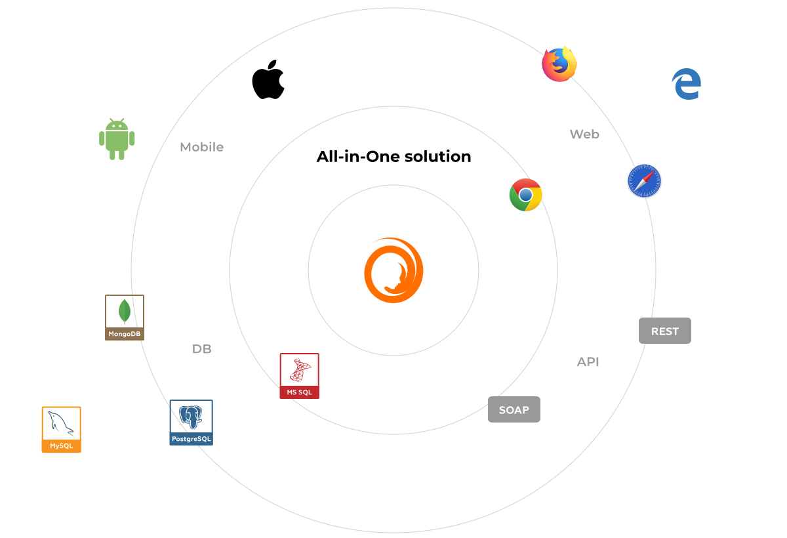

Carina Automation Framework
==================
Carina is Java-based test automation framework that unites all testing layers: Mobile applications (web, native, hybrid), WEB applications, REST services, Databases.

* Carina framework is built on the top of most popular open-source solutions like Selenium, Appium, TestNG which reduces dependability on specific technology stack.

* Carina covers all popular browsers (IE, Safari, Chrome, Firefox) and mobile devices (iOS/Android). Special feature for mobile domain: it reuses test automation code between IOS/Android by 70-80%.

* As far as our framework is build in Java, it is cross-platform. Tests may be easily executed both on Unix or Windows machines all you need is JDK 8 installed.

* Framework supports different types of databases - both relational and nonrelational (MySQL, SQL Server, Oracle, PostgreSQL), providing amazing experience of DAO layer implementation using MyBatis ORM framework.

* API testing is based on Freemarker template engine. It enables great flexibility in generating REST requests and responses dynamically changed by incoming arguments. 



<B>[TRY DEMO PROJECT NOW](https://github.com/qaprosoft/carina-demo)</B>


## Сontents
* [Initial setup](#initial-setup)
* [Project structure](#project-structure)
* [Configuration and execution](#configuration-and-execution)
* [Web UI automation](#web-ui-automation)
* [Web services API automation](#web-services-api-automation)
* [Mobile automation](#mobile-automation)
* [Database access setup](#db-access)
* [Data-providers usage](#data-providers)
* [Git configuration](#git-configuration)
* [License](#license)


## Initial setup
* Install and configure JDK 1.8+
* Install and configure [Apache Maven 3.5.2+](http://maven.apache.org/)
* Download and start latest [Selenium standalone server](http://www.seleniumhq.org/download/)
* Download the latest version of [Eclipse](http://www.eclipse.org/downloads/) and install [TestNG plugin](http://testng.org/doc/download.html)

### Generating project
The easiest way to initialize new project is to use Carina archetype, you will get correct project structure along with test samples:
```
mvn archetype:generate -DarchetypeGroupId=com.qaprosoft \
                       -DarchetypeArtifactId=carina-archetype \
                       -DarchetypeVersion=1.0 \
                       -DgroupId=<your_groupId> \ 
                       -DartifactId=<your_artifactId> \ 
                       -Dname="<you_proj_name>" \
                       -Durl=<your_proj_url> \
                       -Dversion=<your_proj_version>
```
If any attribute contains spaces, it should be set in quoted(e.g.: -Dname="Hello World"). In the Maven command listed above, you have to specify 5 attributes while the first 3 should be left unchanged. Let's go through these attributes:
<table> 
	<tr>
		<th>Attribute</th>
		<th>Meaning</th>
		<th>Example</th>
	</tr>
	<tr>
		<td>-DgroupId</td>
		<td>Company domain in reverce order</td>
		<td>com.qaprosoft</td>
	</tr>
	<tr>
		<td>-DartifactId</td>
		<td>Java project name</td>
		<td>carina-qa</td>
	</tr>
	<tr>
		<td>-Dname</td>
		<td>Name with more details</td>
		<td>"Carina Test Automation"</td>
	</tr>
	<tr>
		<td>-Durl</td>
		<td>Company URL</td>
		<td>http://qaprosoft.com</td>
	</tr>
	<tr>
		<td>-Dversion</td>
		<td>Project version</td>
		<td>1.0</td>
	</tr>
</table>

### Import to Eclipse
If generation finishes successfully, you should see a new project folder with a name equal to the artifactId attribute specified during generation, so navigate to that folder (where pom.xml is located) and execute the following Maven task:
```
mvn clean eclipse:eclipse
```
Using this command, Maven should resolve all dependencies, downloading required libraries to your local repository and generating Eclipse classpath. Before importing a new project to Eclipse, you must link your IDE with your Maven repository by executing the following task:
```
mvn -Dworkspace=<path_to_workspace> eclipse:configure-workspace
```
Here you have to specify the absolute path to the Eclipse workspace. After that, restart Eclipse IDE. Now you may import generated projects such as "Existing Java Project" into Eclipse IDE.
Generate eclipse workspace using command:
```
mvn clean eclipse:eclipse
```
Now you are ready to import project into eclipse.


## Project structure
Carina test project is structured as standard Maven project:
```
carina-demo
|-- pom.xml
|-- src/test/java        
|-- src/test/resources
    |-- api
    |-- testng_suites
    |-- xls
|-- src/main/java
|-- src/main/resources
    |-- l18n
```

* **src/test/java** - contains test classes organized using TestNG annotations


* **src/test/resources** - contains TestNG xml files, API templates and XLS data-providers


* **src/main/java** - contains page object classes, API domains and additional utilities


* **src/main/resources** - contains l18n bundles, configuration properties files and MyBastis profiles if needed


## Configuration and execution
There are multiple properties files located in src/main/resources:
* **_api.properties** - API test endpoints reference
* **_config.properties** - global test configuration
* **_database.properties** - database connection properties
* **_email.properties** - emailable reports config
* **_testdata.properties** - test user credentials

All properties may be retrieved in test using R class:
```
R.API.get("GetUserMethods")
R.CONFIG.get("browser")
R.DATABASE.get("db.url")
R.EMAIL.get("title")
R.TESTDATA.get("user.email")
```

All project configuration properties are located in **_config.properties** file. In the table below we are providing description for most of parameters:
<table> 
	<tr>
		<th>Attribute</th>
		<th>Meaning</th>
                <th>Default value</th>
		<th>Example</th>
	</tr>
	<tr>
		<td>url</td>
		<td>Base application URL</td>
		<td>{must_override}</td>
		<td>http://qaprosoft.com</td>
	</tr>
	<tr>
		<td>browser</td>
		<td>Browser for testing</td>
		<td>chrome</td>
		<td>chrome / firefox / safari / iexplore</td>
	</tr>
	<tr>
		<td>selenium_host</td>
		<td>Selenium server host</td>
		<td>{must_override}</td>
		<td>http://localhost:4444/wd/hub</td>
	</tr>
	<tr>
		<td>app_version</td>
		<td>Application version/build number for reporting</td>
		<td>n/a</td>
		<td>1.2.5</td>
	</tr>
	<tr>
		<td>locale</td>
		<td>Locale for using L10N feature. Enabled when enable_l10n=true</td>
		<td>en_US</td>
		<td>en_GB,de_DE,fr_FR</td>
	</tr>
	<tr>
		<td>language</td>
		<td>Language for i18n defature. Enabled when enable_i18n=true</td>
		<td>en_US</td>
		<td>en_GB,de_DE,fr_FR</td>
	</tr>
	<tr>
		<td>implicit_timeout</td>
		<td>Implicit timeout in seconds to wait for element</td>
		<td>10</td>
		<td>Integer</td>
	</tr>
	<tr>
		<td>retry_internal</td>
		<td>Timeout interval between calling HTML DOM for the element.<br><b>Note:</b> in ms. For mobile automation specify number from 500-1500 range</td>
		<td>2</td>
		<td>Integer</td>
	</tr>
	<tr>
		<td>auto_screenshot</td>
		<td>Global switch for taking screenshots. When disabled only failures will be captured</td>
		<td>true</td>
		<td>Boolean</td>
	</tr>
	<tr>
		<td>keep_all_screenshots</td>
		<td>Keep screenshots artifacts even for passed tests.</td>
		<td>false</td>
		<td></td>
	</tr>
	<tr>
		<td>report_url</td>
		<td>Direct HTTP link to Jenkins workspace report folder. Automatically specified by CI</td>
		<td>n/a</td>
		<td>http://localhost:8888/job/my_project/1/eTAF_Report</td>
	</tr>
	<tr>
		<td>max_screen_history</td>
		<td>Max number of reports in history</td>
		<td>10</td>
		<td>Integer</td>
	</tr>
	<tr>
		<td>jira_url</td>
		<td>JIRA base URL for direct links with bugs description</td>
		<td>n/a</td>
		<td>https://jira.carina.com/browse/</td>
	</tr>
	<tr>
		<td>email_list</td>
		<td>Comma-separated list of emails for reports</td>
		<td>{must_override}</td>
		<td>u1@gmail.com,u2@gmail.com</td>
	</tr>
	<tr>
		<td>sender_email</td>
		<td>Email account for reports sending. <br><b>Note:</b> Gmail smtp settings are used by default. Update _email.properties to use your own SMTP server</td>
		<td>{must_override}</td>
		<td>carina.qareport@qaprosoft.com</td>
	</tr>
	<tr>
		<td>sender_pswd</td>
		<td>Email password for reports sending</td>
		<td>{must_override}</td>
		<td>pwd123</td>
	</tr>
</table>

Most of the properties may be read in the following way:
```
Configuration.get(Parameter.URL) // returns string value
Configuration.getBoolean(Parameter.AUTO_SCREENSHOT) // returns boolean value
Configuration.getInt(Parameter.SMALL_SCREEN_WIDTH) // returns integer value
Configuration.getDouble(Parameter.BROWSER_VERSION) // returns double value
```

### Environment specific configuration
In some cases it is required to support multiple environments for testing. Let's assume we have STAG and PROD environments which have different application URLs. In this case we need specify the following properties in _config.properties:
```
env=DEMO
STAG.url=http://stag-app-server.com
PROD.url=http://prod-app-server.com
```

And get env-specific argument in test in the following way:
```
Configuration.getEnvArg("url")
```
As a result you switch between environments just changing env argument in _config.properties file.

### Execution
There are a few options to execute the test, you may run test suite from Eclipse IDE or initiate test execution from the console using the Maven Surefire plugin built into the Carina framework. Before running tests make sure you downloaded selenium standalone server jar file and started it by the following command:
```
java -jar selenium-server-standalone-3.6.0.jar
```

To run the test suite from Eclipse IDE, just select the required TestNG xml file: Right click > Run As > TestNG suite


To run the same test suite from the console, navigate to the test project root (where pom.xml is located) and execute the following command:

```
mvn clean -Dsuite=api test
```

## Web UI automation
TODO

## Web services API automation
TODO

## Mobile automation
We could provide any Appium capabilty in **_config.properties** file using <i>capabilities.< name >=< value ></i> format. In the table below we are providing description for the most popular mobile capabilities:

<table> 
	<tr>
		<th>Attribute</th>
		<th>Meaning</th>
                <th>Default value</th>
		<th>Example</th>
	</tr>
        <tr>
		<td>capabilities.deviceName</td>
		<td>Device name for report</td>
                <td>n/a</td>
		<td>Sumsung_Galaxy_J5</td>
	</tr>
        <tr>
		<td>capabilities.deviceType</td>
		<td>The only custom carina capability to detmine type of device</td>
                <td>n/a</td>
		<td>phone/tablet/tv...</td>
	</tr>
        <tr>
		<td>capabilities.platformName</td>
		<td>Name of mobile platform</td>
                <td>n/a</td>
		<td>Android/iOS/AndroidTV/tvOS</td>
	</tr>
        <tr>
		<td>capabilities.platformVersion</td>
		<td>Version of mobile platform</td>
                <td>n/a</td>
		<td>6.0.1</td>
	</tr>
        <tr>
		<td>capabilities.automationName</td>
		<td>Name of programm using for automation</td>
                <td>n/a</td>
		<td>Appium/uiautomator2/XCUITest</td>
	</tr>
        <tr>
		<td>capabilities.app</td>
		<td>Path to application (apk/app/ipa) which is tested, Can be provided as a pattern from AWS S3 storage with automatic downloading...</td>
                <td>n/a</td>
		<td>D:/application.apk</td>
	</tr>
        <tr>
		<td>capabilities.newCommandTimeout</td>
		<td>New implicit timeout in seconds to wait for element for mobile automation</td>
                <td>n/a</td>
		<td>180</td>
	</tr>
        <tr>
		<td>capabilities.udid</td>
		<td>Unique Device ID</td>
                <td>n/a</td>
		<td>759b543c</td>
	</tr>
</table>

### For Android:
```
#=============== Android Mobile ======================#
capabilities.deviceName=Samsung_Galaxy_J5
capabilities.app=s3://qaprosoft.com/android/myapk.*-release.apk
capabilities.skipUnlock=true
capabilities.noSign=true
capabilities.automationName=uiautomator2
capabilities.newCommandTimeout=180
capabilities.platformName=ANDROID
capabilities.autoGrantPermissions=true
#=====================================================#
```

### For iOS:
```
#=================== iOS Mobile ======================#
capabilities.autoAcceptAlerts=true
capabilities.app=/opt/apk/my-apk.app
capabilities.automationName=XCUITest
capabilities.newCommandTimeout=180
capabilities.platformName=IOS
#=====================================================#
```

### ExtendedWebElement

ExtendedWebElement is an extended version of selenium WebElement which you can find in org.openqa.selenium package. The best thing in using ExtendedWebElement is that you can use both all old methods of WebElement and new more comfortable Carina methods.

The simpliest way to find ExtendedWebElement is using annotation @FindBy. The @FindBy annotation is used to locate one or more ExtendedWebElements using a single criterion. The list of criterions is standart:
* className
* css
* how...using
* id
* linkText
* name
* partialLinkText
* tagName
* xpath

```   
    @FindBy(name = "Hybrid")
    private ExtendedWebElement hybridUnits;

    @FindBy(id = "com.ua.record.debug:id/spinner_text")
    private List <ExtendedWebElement> unitsVersions;
```   

### ExtededWebElement's methods
Most usable methods are reperesented in the table bellow:

<table>
   <tr>
      <th>Method</th>
      <th>Return type</th>
      <th>Description</th>
   </tr>
   <tr>
      <td>getName()</td>
      <td>String</td>
      <td>Get the name of this element</td>
   </tr>
   <tr>
      <td>getText()</td>
      <td>String</td>
      <td>Get the visible innerText of this element</td>
   </tr>
   <tr>
      <td>getAttribute()</td>
      <td>String</td>
      <td>Get the value of a the given attribute of this element</td>
   </tr>
   <tr>
      <td>click()</td>
      <td>void</td>
      <td>Click on element</td>
   </tr>
   <tr>
      <td>doubleClick()</td>
      <td>void</td>
      <td>Double click on element</td>
   </tr>
   <tr>
      <td>isElementPresent()</td>
      <td>boolean</td>
      <td>Is element present or not?</td>
   </tr>
   <tr>
      <td>isElementPresent(long timeout)</td>
      <td>boolean</td>
      <td>Is element present or not during the timeout in seconds?</td>
   </tr>
   <tr>
      <td>isElementNotPresent(long timeout)</td>
      <td>boolean</td>
      <td>Is element not present during the timeout in seconds?</td>
   </tr>
   <tr>
      <td>isElementWithTextPresent(String text)</td>
      <td>boolean</td>
      <td>Is element with text present or not?</td>
   </tr>
   <tr>
      <td>isElementWithTextPresent(String text, long timeout)</td>
      <td>boolean</td>
      <td>Is element with text present or not during the timeout in seconds?</td>
   </tr>
   <tr>
      <td>clickIfPresent</td>
      <td>boolean</td>
      <td>Click on element if it's presented, return true if click is performed</td>
   </tr>
   <tr>
      <td>type(String text)</td>
      <td>void</td>
      <td>Clear the value of field and simulate typing the text</td>
   </tr>
   <tr>
      <td>scrollTo()</td>
      <td>void</td>
      <td>Scroll page until the element could be located</td>
   </tr>
   <tr>
      <td>check()</td>
      <td>void</td>
      <td>If element is checkable it will be checked</td>
   </tr>
   <tr>
      <td>uncheck()</td>
      <td>void</td>
      <td>If element is checkable it will be unchecked</td>
   </tr>
   <tr>
      <td>isCheck()</td>
      <td>boolean</td>
      <td>If element is checkable return is the element checked or not </td>
   </tr>
   <tr>
      <td>tapWithCoordinates(double x, double y)</td>
      <td>void</td>
      <td>Tap on screen using the given cordinates </td>
   </tr>
</table>

### How to use WebDriver methods?
You can simple transform ExtendedWebElement to WebElement using getElement() method. After this it's possible to operate with standart WebElement methods.
```   
   Point point = element.getElement().getLocation();
   Dimension dim = element.getElement().getSize();
```   

## Database access setup
TODO

## Data-providers usage
TODO

## Git configuration 
1). **Fork repository** `https://github.com/qaprosoft/carina` to your own user.

2). **Clone your fork to your local machine**:

 `git clone git@github.com:your_fork_url/carina.git`

3). `git remote add origin <your_fork_url>` (can be already added)

4). `git fetch origin`

5). `git remote add upstream git@github.com:qaprosoft/carina.git`

6). `git fetch upstream`

7). `git checkout -b work_local_branch upstream/master`

And then after adding files (`git add` ...) use `git commit` (add description) and then`push`:

    git push origin work_local_branch:work_remote_branch
    
And on [https://github.com/qaprosoft/carina](https://github.com/qaprosoft/carina) you will see possibility to "Compare & Pull Request"

## License
Code - [Apache Software License v2.0](http://www.apache.org/licenses/LICENSE-2.0)

Documentation and Site - [Creative Commons Attribution 4.0 International License](http://creativecommons.org/licenses/by/4.0/deed.en_US)
