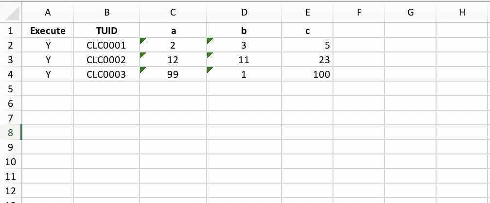

Modern test automation frameworks should support data-driven testing, when you are able to verify a variety of edge cases providing test data sets into the tests using external data sources. 
Carina is not an exception, the framework supports multiple ways of test parametrization (see the [TestNG approach samples](https://github.com/zebrunner/carina-demo/blob/master/src/test/java/com/zebrunner/carina/demo/DataProvidersSampleTest.java), [Carina's custom data provider samples](https://github.com/zebrunner/carina-demo/blob/master/src/test/java/com/zebrunner/carina/demo/CustomDataProvidersSampleTest.java)):

* Java data providers
* XML parametrization
* XLS data providers
* CSV data providers

## Java data provider
As far as Carina is based on TestNG framework, you are able to use well known Java data providers which return a matrix of Objects and pass it to the appropriate test arguments. You have to use dataProvider attribute along with @Test annotation and implement the method annotated with `@DataProvider` that will return `Object[][]` as a test data set:
```
@Test(dataProvider = "DP1")
public void testMultiplyOperation(int a, int b, int c)
{
	int actual = a * b;
	int expected = c;
	Assert.assertEquals(actual, expected, "Invalid multiply result!");
}

@DataProvider(parallel = false, name = "DP1")
public static Object[][] dataprovider()
{
	return new Object[][] {
		{ 2, 3, 6 },
		{ 6, 6, 36 },
		{ 5, 8, 40 } 
	};
}
```

## XML parametrization
TestNG supports parametrization from XML files when you organize test suites using XML files. The parameterized test method should be annotated with `@Parameters({ "a", "b", "c" })` and appropriate method arguments should be listed. Also, you have to pass all required parameters from an XML suite file:
```
@Test
@Parameters({ "a", "b", "c" })
public void testSubtractOperation(int a, int b, int c) {
	int actual = Integer.valueOf(a) - Integer.valueOf(b);
	int expected = Integer.valueOf(c);
	Assert.assertEquals(actual, expected, "Invalid subtract result!");
}

...
<test name="Subtract operation test">
	<parameter name="a" value="12"/>
	<parameter name="b" value="3"/>
	<parameter name="c" value="9"/>
	<classes>
		<class name="com.zebrunner.carina.demo.DataprovidersSampleTest">
			<methods>
				<include name="testSubtractOperation"/>
			</methods>
		</class>
	</classes>
</test>
...

```
## Adding test unique identifier (TUID) to the test name using Java data provider

TUID sets at the beginning of the test name in a test result report.

### Prerequisites

For this functionality to work, update your maven-compiler-plugin (add `--parameters` compiler argument)

```
<plugin>
    <groupId>org.apache.maven.plugins</groupId>
	<artifactId>maven-compiler-plugin</artifactId>
	...
	<configuration>
		<compilerArgs>
			    <arg>-parameters</arg>
			</compilerArgs>
	</configuration>
</plugin>
```

### Implementation

If you want to add TUID information to the Java data provider, for example

```
    @DataProvider(name = "dataProvider")
    public static Object[][] dataprovider() {
        return new Object[][]{
                ...
    }
```

you should do the following:

1. Add to the data provider field with test unique identifier (TUID), for example:

```
@DataProvider(name = "DP1")
public static Object[][] dataprovider() {
    return new Object[][]{
        {"Data1", "some data", ... },
        {"Data2", "some data", ... },
        {"Data3", "some data", ... }
    };
}
```

where `"Data1"`, `"Data2"`, `"Data3"` in this example is the tests unique identifiers.

2. In the test, that use our provider, for example

```
@Test(dataProvider = "DP1")
public void testDataProvider(...) {
    ...
}
```

when you receive data from the data provider, you must name the method parameter
that receives a TUID as `TUID`, for example:

```
@Test(dataProvider = "DP1")
public void testDataProvider(String TUID, String data, ...) {
    ...
}
```


## Custom data providers

### Pre requirements

To use custom provider feature, add certain dependency to your pom.xml

```xml
<dependency>
    <groupId>com.zebrunner</groupId>
    <artifactId>carina-dataprovider</artifactId>
    <version>RELEASE</version>
</dependency>
```

Visit our [github](https://github.com/zebrunner/carina-dataprovider/releases) to check the latest version of carina-dataprovider.

### Implementation
Carina test framework provides a possibility to write all tests with data providers in one place, including parameterization using external XLS/CSV spreadsheets. First of all, you need to declare a test class that implements `com.zebrunner.carina.core.IAbstractTest.java` and `com.zebrunner.carina.dataprovider.IAbstractDataProvider.java`.

After that, you can specify data provider tests as follows.

```
public class CustomDataProvidersSampleTest implements IAbstractTest, IAbstractDataProvider {
    @Test(dataProvider = "DataProvider")
    @XlsDataSourceParameters(path = "data_source/demo.xlsx", sheet = "Calculator", dsUid = "TUID", dsArgs = "a,b,c")
    public void testXlsSumOperation(String a, String b, String c) {
        int actual = Integer.valueOf(a) + Integer.valueOf(b);
        int expected = Integer.valueOf(c);
        Assert.assertEquals(actual, expected, "Invalid sum result!");
    }
}
```

This test uses XLS files as a data source. Every line in a spreadsheet is a set of arguments for a test. You should specify the `dataProvider` parameter for TestNG annotation `@Test`.  
`IAbstractDataProvider` interface defines several data provider methods to implement:

* use `@Test(dataProvider = "DataProvider")` for common use cases.

* use `@Test(dataProvider = "SingleDataProvider")` for a single-thread execution.

To specify the `xls`/`csv` spreadsheets for a test, you should declare `@XlsDataSourceParameters`/`@CsvDataSourceParameters` annotation and define its parameters.

Common data sources annotation parameters:
<table>
    <tr>
        <th>Parameter</th>
        <th>Meaning</th>
        <th>Example</th>
    </tr>
    <tr>
        <td>path</td>
        <td>File path located in src/test/resources</td>
        <td>path = "data_source/demo.xlsx"</td>
    </tr>
    <tr>
        <td>dsUid</td>
        <td>Defines column name from spreadsheet with unique identifiers</td>
        <td>dsUid = "TUID"</td>
    </tr>
    <tr>
        <td>dsArgs</td>
        <td>Defines column names from spreadsheet that should be passed to test by splitting it with ','.</td>
        <td>dsArgs = "a,b,c"</td>
    </tr>
    <tr>
        <td>staticArgs</td>
        <td>Defines parameter name from testNG suite which value will be passed in test. This value will be present in every test</td>
        <td>in data source annoation: staticArgs = "key"<br> 
            in suite: &lt;parameter name="key" value="arg"/&gt;</td>
    </tr>
    <tr>
        <td>testMethodColumn</td>
        <td>Defines column name which contains values for test name overriding</td>
        <td>testMethodColumn = "TestTitle"</td>
    </tr>
    <tr>
        <td>executeColumn</td>
        <td>Defines column name that determines whether to add row to test run or not.<br>
            Default - 'Execute'</td>
        <td>executeColumn = "Records to run"</td>
    </tr>
    <tr>
        <td>executeValue</td>
        <td>Defines value by which tests will be added to test run if it equals to value from executeColumn.<br>
            Default - 'y'</td>
        <td>executeValue = "+"</td>
    </tr>
    <tr>
        <td>groupColumn</td>
        <td>Every row in table being grouped by value from selected groupColumn.
            Provide arguments to test as List&lt;Map&lt;String, String&gt;&gt; for 1 test</td>
        <td>groupColumn = "country"</td>
    </tr>
</table>

CsvDataSourceParameters can also contain:
<table>
    <tr>
        <th>Parameter</th>
        <th>Meaning</th>
        <th>Example</th>
    </tr>
    <tr>
        <td>separator</td>
        <td>Defines column separator for parsing<br>
            Default - ','</td>
        <td>separator = ";"</td>
    </tr>
    <tr>
        <td>quote</td>
        <td>defines the character to use for quoted elements when parsing.<br>
            Default - '"'</td>
        <td>quote = "©"</td>
    </tr>
</table>

XlsDataSourceParameters can also contain:
<table>
    <tr>
        <th>Parameter</th>
        <th>Meaning</th>
        <th>Example</th>
    </tr>
    <tr>
        <td>sheet</td>
        <td>Defines sheet to parse</td>
        <td>sheet = "calculator"</td>
    </tr>
    <tr>
        <td>spreadsheetId</td>
        <td>Defines spreadsheet's id. Is mutually exclusive with path</td>
        <td>spreadsheetId = "abc1234567"</td>
    </tr>
</table>

Several parameters from annotation could be overridden in suite. Such parameters:

<table>
    <tr>
        <th>Parameter</th>
        <th>Meaning</th>
        <th>Example</th>
    </tr>
    <tr>
        <td>{ds_file}</td>
        <td>File path located in src/test/resources</td>
        <td>&lt;parameter name="{ds_args}" value="data_source/demo.xlsx"/&gt;</td>
    </tr>
    <tr>
        <td>{excel_ds_sheet}</td>
        <td>Defines sheet to parse</td>
        <td>&lt;parameter name="{excel_ds_sheet}" value="calculator"/&gt;</td>
    </tr>
    <tr>
        <td>{ds_args}</td>
        <td>Defines column names from spreadsheet that should be passed to test by splitting it with ','</td>
        <td>&lt;parameter name="{ds_args}" value="a,b,c"/&gt;</td>
    </tr>
    <tr>
        <td>{ds_uid}</td>
        <td>Defines column name from spreadsheet with unique identifiers</td>
        <td>&lt;parameter name="{ds_uid}" value="TUID"/&gt;</td>
    </tr>
    <tr>
        <td>{ds_execute_column}</td>
        <td>Defines column name that determines whether to add row to test run or not.<br>
            Default - 'Execute'</td>
        <td>&lt;parameter name="{ds_execute_column}" value="Records to run"/&gt;</td>
    </tr>
    <tr>
        <td>{ds_execute_value}</td>
        <td>Defines value by which tests will be added to test run if it equals to value from executeColumn.<br>
            Default - 'y'</td>
        <td>&lt;parameter name="{ds_execute_value}" value="+"/&gt;</td>
    </tr>
</table>

Here you can look at a spreadsheet as a data source example for test:



## DataProvider with huge number of columns
In some cases, we have to provide 10+ columns into a test. In this case, there is one tricky point. Just removing dsArgs parameter will collect all the lines into a single Map<String, String> object, so you can dynamically get any column in a test using the column name.
```
public class CustomDataProvidersSampleTest implements IAbstractTest, IAbstractDataProvider {
    @Test(dataProvider = "DataProvider")
    @XlsDataSourceParameters(path = "data_source/demo.xlsx", sheet = "Calculator", dsUid = "TUID")
    public void testSumOperationFromMap(Map<String, String> args) {
        int actual = Integer.valueOf(args.get("a")) + Integer.valueOf(args.get("b"));
        int expected = Integer.valueOf(args.get("c"));
        Assert.assertEquals(actual, expected, "Invalid sum result!");
    }
}
```
