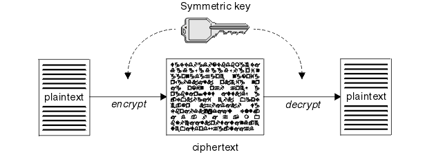
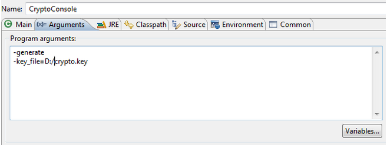
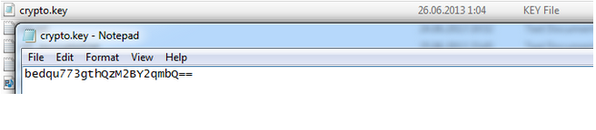
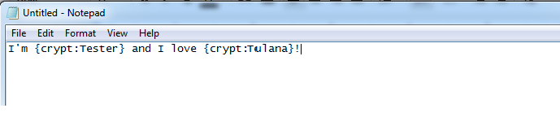
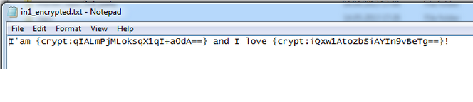
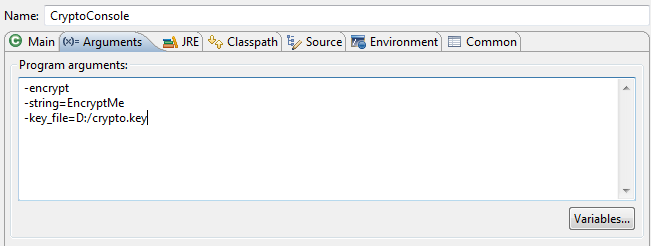
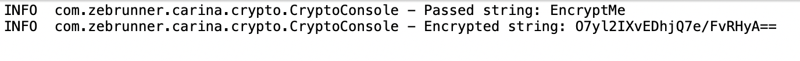
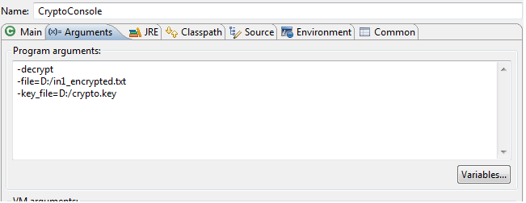
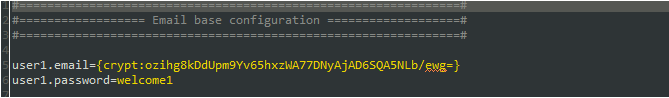

Security functionality in Carina framework is required for sensitive data that should be hidden in test configurations and logging. It uses a symmetric key encryption algorithm for security implementation, which means that anyone may encrypt/decrypt the data in the same way, using the same key. In Carina framework, AES encryption is used by default with a 128-bit security key.



Anyone may generate their own security key and encrypt the data using this key, so that the decrypted valid data may be used in the test only if the valid key is specified in the test configuration. Also, one may use the default common key located in test resources, giving access to all other users for secured data decryption.

## Secured data preparation
For secured data preparation, we implemented a special tool that helps to generate crypto keys and encrypt/decrypt test data files. Here is a usage tip:
```
com.zebrunner.carina.crypto.CryptoConsole -help
com.zebrunner.carina.crypto.CryptoConsole -generate -algorithm "algorithm" -keysize="key size"
com.zebrunner.carina.crypto.CryptoConsole -encrypt -algorithm "algorithm" -key="key" -string="string_to_encrypt"
com.zebrunner.carina.crypto.CryptoConsole -encrypt -algorithm "algorithm" -key="key" -string="string_to_encrypt"
com.zebrunner.carina.crypto.CryptoConsole -encrypt -algorithm "algorithm" -key="key" -pattern="pattern" -string="string_to_encrypt"
com.zebrunner.carina.crypto.CryptoConsole -encrypt -algorithm "algorithm" -key="key" -wrapper="wrapper" -string="string_to_encrypt"
com.zebrunner.carina.crypto.CryptoConsole -encrypt -algorithm "algorithm" -key="key" -pattern="pattern" -wrapper="wrapper" -string="string_to_encrypt"
com.zebrunner.carina.crypto.CryptoConsole -decrypt -algorithm "algorithm" -key="key" -string="string_to_encrypt"
com.zebrunner.carina.crypto.CryptoConsole -decrypt -algorithm "algorithm" -key="key" -pattern="pattern" -string="string_to_encrypt"
com.zebrunner.carina.crypto.CryptoConsole -decrypt -algorithm "algorithm" -key="key" -wrapper="wrapper" -string="string_to_encrypt"
com.zebrunner.carina.crypto.CryptoConsole -decrypt -algorithm "algorithm" -key="key" -pattern="pattern" -wrapper="wrapper" -string="string_to_encrypt"
com.zebrunner.carina.crypto.CryptoConsole -encrypt -algorithm "algorithm" -key="key" -file="path_to_file_to_encrypt"
com.zebrunner.carina.crypto.CryptoConsole -decrypt -algorithm "algorithm" -key="key" -file="path_to_file_to_encrypt"
```

**To generate an individual crypto key:**

1. Go to "Run configuration" in Eclipse
2. Create a new Java application configuration selecting the project and the main class **com.zebrunner.carina.crypto.CryptoConsole**:

3. Set arguments

4. Press Apply and then Run
5. A crypto key will be generated:


**To prepare a test data file with secured data:**

1. Prepare an input file  using the pattern {crypt:str_to_encrypt} for secured values

2. Prepare an input file  using the pattern {crypt:str_to_encrypt} for secured values.
Go to “Run configuration”, navigate to the arguments tab and execute the encryption command specifying the key and input file:

3. A file with encrypted data will be generated:

4. To encrypt a single string, use the following config:

5. The encrypted string will be shown in the console:

6. To decrypt the encrypted file, execute:

7. The decrypted file will be generated:


## Secured data usage
You may use encrypted values, both in test configuration and test data files; pay attention to the fact that there is no explicit BeforeTest listener for data decryption, so there is no way to find out later in the test if the data is sensitive or not. All the decryption logic is located in WebDriverHelper that wraps Selenium WebDriver methods for interaction with UI and encapsulates action logging logic. Every method that receives a text tests if the text contains {crypt:...} pattern, and if it does, decrypts it and passes it to UI- logging, and screenshots are populated with hidden characters:


Сarina also supports advanced decryption. This means that you can decrypt only the part of the string that you need. This the `decryptByPattern` method of the CryptoTool class.
To decrypt your string use it like this:
```
String value = "test@gmail.com/{crypt:8O9iA4+f3nMzz85szmvKmQ==}"

CryptoTool cryptoTool = CryptoToolBuilder.builder()
                    .chooseAlgorithm(Algorithm.find(Configuration.get(Parameter.CRYPTO_ALGORITHM)))
                    .setKey(Configuration.get(Parameter.CRYPTO_KEY_VALUE))
                    .build();
String CRYPTO_PATTERN = Configuration.get(Parameter.CRYPTO_PATTERN);
String decryptedValue = cryptoTool.decrypt(value, CRYPTO_PATTERN);
```
As a result `decryptedValue` will be `test@gmail.com/EncryptMe`.
