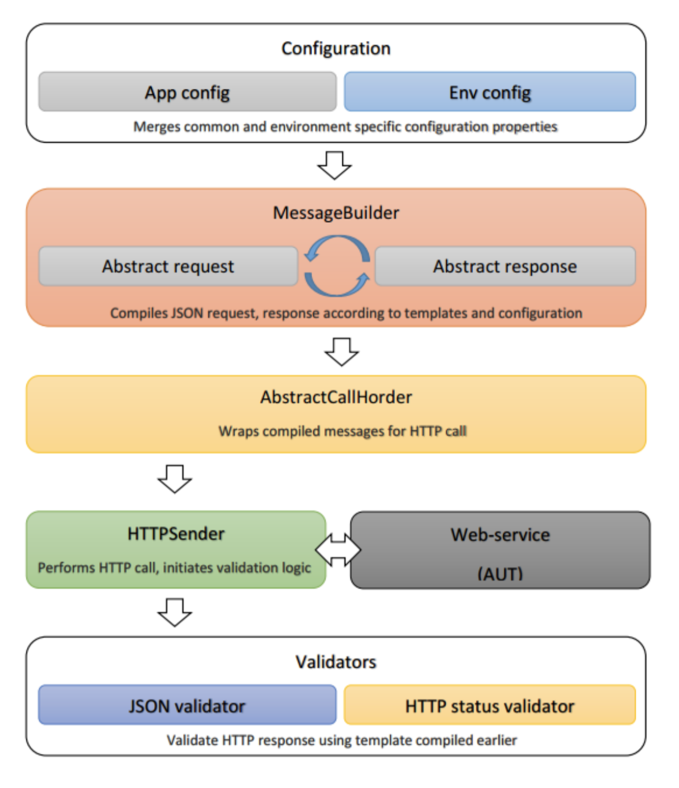

Rest API testing is a vital part of integration testing process, it may be used separately or in complex with web, mobile or DB testing. General process may be described by the following steps:

1. Compile HTTP request with required meta data
2. Send prepared data to required server endpoint
3. Validate HTTP status and response data
4. Extract some response data for the next requests

Schema below demonstrates the sequence:

From that perspective we decided to use the following instruments:

* Rest-assured - "Testing and validation of REST services in Java is harder than in dynamic languages such as Ruby and Groovy. REST
Assured brings the simplicity of using these languages into the Java domain."
* Freemarker - "Apache FreeMarker is a template engine: a Java library to generate text output (HTML web pages, e-mails, configuration
files, source code, etc.) based on templates and changing data."
