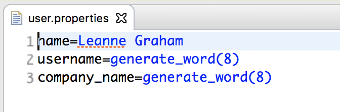
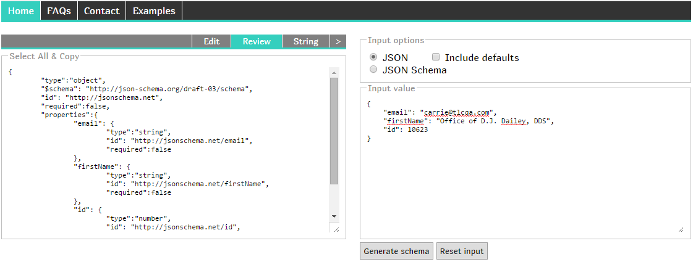

Rest API testing is a vital part of integration testing process, it may be used separately or together with web, mobile or DB testing. The general process may be described by the following steps:

1. Compile an HTTP request with the required meta data
2. Send the prepared data to the required server endpoint
3. Validate the HTTP status and response data
4. Extract some response data for the next requests
5. Build a call to the next (or the same) endpoint using (or not using) the data from the previous response

The schema below demonstrates the sequence:


From this perspective, we decided to use the following instruments:

* Rest-assured - "Testing and validation of REST services in Java are harder than in dynamic languages such as Ruby and Groovy. REST
Assured brings the simplicity of using these languages into the Java domain."
* Freemarker - "Apache FreeMarker is a template engine: a Java library to generate text output (HTML web pages, e-mails, configuration
files, source code, etc.) based on templates and changing data."
* JsonPath - a library for extracting data from JSON body
* JsonAssert - a library for comparing the actual JSON body with an expected one
* Json-schema-validator - a library for validating of JSON body for matching to JSON schema

### Pre requirements

To use api feature, add certain dependency to your pom.xml

```xml
<dependency>
    <groupId>com.zebrunner</groupId>
    <artifactId>carina-api</artifactId>
    <version>RELEASE</version>
</dependency>
```

Visit our [github](https://github.com/zebrunner/carina-api/releases) to check the latest version of carina-api. 

### Example of test implementation
Let's create an automated test for the next call: POST https://jsonplaceholder.typicode.com/users request with a request body
```json
[
    {
        "id": 1,
        "name": "SOME_NAME",
        "username": "SOME_USERNAME",
        "email": "Sincere@april.biz",
        "address": {
            "street": "Kulas Light",
            "suite": "Apt. 556",
            "city": "Gwenborough",
            "zipcode": "92998-3874",
            "geo": {
                "lat": "-37.3159",
                "lng": "81.1496"
            }
        },
        "phone": "1-770-736-8031 x56442",
        "website": "hildegard.org",
        "company": {
            "name": "SOME_COMPANY_NAME",
            "catchPhrase": "Multi-layered client-server neural-net",
            "bs": "harness real-time e-markets"
        }
    }
]
```
and the response body the same as the request body

#### Definition of request and response templates
If we are going to send POST request, we need to create a request template with some placeholders that may be replaced by different arguments for different test flows. The best place to store these resources is src/test/resources/api package, try to keep REST hierarchy in a package structure for better maintenance and visibility:


Request (rq.json) and response (rs.json) templates have some placeholders that will be populated from the tests later on:


While user.properties contains some default value which may be replaced later:



#### REST service call domain object [DEPRECATED]
Now we are ready to create REST service domain object which will be used to interact with web service and perform additional response validations. Our domain object is located in /carina-demo/src/main/java/com/zebrunner/carina/demo/api, make sure that it extends AbstractApiMethodV2 and triggers the base class constructor for initialization. In general cases, you will specify the path to request and response templates along with default properties files (all of them have been created in the previous step). Also, we replace the URL placeholder to set an appropriate environment.
```java
package com.zebrunner.carina.demo.api;

import com.zebrunner.carina.api.AbstractApiMethodV2;
import com.zebrunner.carina.utils.Configuration;

public class PostUserMethod extends AbstractApiMethodV2 {
    public PostUserMethod() {
        super("api/users/_post/rq.json", "api/users/_post/rs.json", "api/users/user.properties");
        replaceUrlPlaceholder("base_url", Configuration.getEnvArg("api_url"));
    }
}
```

#### HTTP method and path [DEPRECATED]
The last step before the test implementation itself is the association of the domain object class and the required HTTP method and path.
It should be defined in /carina-demo/src/main/resources/_api.properties file, the key should be equal to domain class name, the value has the following pattern {http_method}:{http_path}. The HTTP path may contain placeholders, the HTTP method should be one of the following variants: GET, POST, PUT, UPDATE, DELETE.
```properties
#=====================================================#
#=================== API methods  ====================#
#=====================================================#
GetUserMethods=GET:${base_url}/users
PostUserMethod=POST:${base_url}/users
DeleteUserMethod=DELETE:${base_url}/users/1
PutPostsMethod=PUT:${base_url}/posts/1
PatchPostsMethod=PATCH:${base_url}/posts/1
```
#### REST service call domain object (Annotation based approach)

Approach based on initialisation of super class constructor is deprecated and more convenient way is to use annotations. They can be used over class declarations. For api testing we can use such annotations:

1. `@ContentType` - is used to define the value of Content-type header in response
2. `@Cookie` - is used to specify cookies in the request
3. `@Endpoint` - combination of http method + url which defines any single API endpoint
4. `@Header` - is used to specify headers in the request
5. `@HideRequestBodyPartsInLogs` - is used to hide sensitive parts of the request body in the logs
6. `@HideRequestHeadersInLogs` - is used to hide sensitive parts of the request headers in the logs
7. `@HideResponseBodyPartsInLogs` - is used to hide secret parts of the response body in the logs
8. `@PropertiesPath` - contains a path to default properties file for endpoint templates (relative path from root of code sources)
9. `@QueryParam` - is used to specify query parameters in the request
10. `@RequestTemplatePath` - contains a path to default request template for mentioned endpoint (relative path from root of code sources)
11. `@ResponseTemplatePath` - contains a path to default response template for mentioned endpoint (relative path from root of code sources)
12. `@SuccessfulHttpStatus` - specifies the expected HTTP status for happy-path scenarios

In this case we don’t need to define _api.properties file and call the constructor of a super class, but if we have some properties file used in this request we should explicitly set it in test method. Insead of callAPI() and expectResponseStatus() methods we can use callAPIExpectSuccess() that will call API expecting http status in response taken from @SuccessfulHttpStatus value.
```java
@Endpoint(url = "${base_url}/users/1", methodType = HttpMethodType.DELETE)
@RequestTemplatePath(path = "api/users/_delete/rq.json")
@ResponseTemplatePath(path = "api/users/_delete/rs.json")
@SuccessfulHttpStatus(status = HttpResponseStatusType.OK_200)
public class DeleteUserMethod extends AbstractApiMethodV2 {
    public DeleteUserMethod() {
        replaceUrlPlaceholder("base_url", Configuration.getEnvArg("api_url"));
    }
}
```   
Also placeholders in URL can be automatically replaced by carina if they're specified in carina configuration properties (config.properties).
To make auto-replacement happen just use next syntax in your URL:
- when param starts with `config.\*` then `R.CONFIG.get("\*")` will be used as a replacement
- when param starts with `config.env.\*` then `Configuration.getEnvArg("\*")` will be used as a replacement

So you may use next implementation:   
```java
@Endpoint(url = "${config.env.base_url}/users/1", methodType = HttpMethodType.DELETE)
public class DeleteUserMethod extends AbstractApiMethodV2 {
}
```   
And before sending of request base part of URL will be set by carina depending on used environment automatically.

#### API test
API test is a general TestNG test, a class should extend APITest, in our case, the test implements IAbstractTest that encapsulates some test data and login method. The test is located in /carina-demo/src/test/java/com/zebrunner/carina/demo.
```java
package com.zebrunner.carina.demo;

import java.lang.invoke.MethodHandles;

import org.skyscreamer.jsonassert.JSONCompareMode;
import org.slf4j.Logger;
import org.slf4j.LoggerFactory;
import org.testng.annotations.Test;

import com.zebrunner.carina.api.apitools.validation.JsonCompareKeywords;
import com.zebrunner.carina.core.IAbstractTest;
import com.zebrunner.carina.core.registrar.ownership.MethodOwner;
import com.zebrunner.carina.core.registrar.tag.TestPriority;
import com.zebrunner.carina.core.foundation.utils.tag.TestPriority;
import com.zebrunner.carina.demo.api.DeleteUserMethod;
import com.zebrunner.carina.demo.api.GetUserMethods;
import com.zebrunner.carina.demo.api.PostUserMethod;

/**
 * This sample shows how create REST API tests.
 *
 * @author qpsdemo
 */
public class APISampleTest implements IAbstractTest {

    private static final Logger LOGGER = LoggerFactory.getLogger(MethodHandles.lookup().lookupClass());

    @Test()
    @MethodOwner(owner = "qpsdemo")
    public void testCreateUser() {
        LOGGER.info("test");
        setCases("4555,54545");
        PostUserMethod api = new PostUserMethod();
        api.expectResponseStatus(HttpResponseStatusType.CREATED_201);
        api.callAPI();
        api.validateResponse();
    }

    @Test()
    @MethodOwner(owner = "qpsdemo")
    public void testCreateUserMissingSomeFields() {
        PostUserMethod api = new PostUserMethod();
        api.setProperties("api/users/user.properties");
        api.getProperties().remove("name");
        api.getProperties().remove("username");
        api.callAPIExpectSuccess();
        api.validateResponse();
    }

    @Test()
     @MethodOwner(owner = "qpsdemo")
     public void testGetUsers() {
         GetUserMethods getUsersMethods = new GetUserMethods();
         getUsersMethods.callAPIExpectSuccess();
         getUsersMethods.validateResponse(JSONCompareMode.STRICT, JsonCompareKeywords.ARRAY_CONTAINS.getKey());
         getUsersMethods.validateResponseAgainstSchema("api/users/_get/rs.schema");
     }

    @Test()
    @MethodOwner(owner = "qpsdemo")
    @TestPriority(Priority.P1)
    public void testDeleteUsers() {
        DeleteUserMethod deleteUserMethod = new DeleteUserMethod();
        deleteUserMethod.setProperties("api/users/user.properties");
        deleteUserMethod.callAPIExpectSuccess();
        deleteUserMethod.validateResponse();
    }
}
```

#### Test steps once again
1. Create REST call object
2. Specify the properties for a request/response placeholder
3. Add headers if required
4. Specify the expected HTTP status
5. Call API
6. Validate the response by a template or parse some data by JSON path
7. Make further calls using the data from the previous call if needed

#### REST service call domain object (Declarative approach)

Approach based on implicit instantiation of the `AbstractApiMethod`.
It allows to:   
- more convenient and efficiently organize description of endpoints;
- have all carina api methods for the same URL pattern be defined within single class;
- reduce time for the implementation of the desired `AbstractApiMethod`;
- flexibly configure all api methods with Java annotations.

Here is example of multiple api methods definition for one url pattern. Base url template can be easily overwritten with use of `@EndpointTemplateMethod` annotation:
```java
package com.zebrunner.carina.demo.api;

import com.zebrunner.carina.api.AbstractApiMethodV2;
import com.zebrunner.carina.api.annotation.EndpointTemplate;
import com.zebrunner.carina.api.annotation.EndpointTemplateMethod;
import com.zebrunner.carina.api.annotation.PathParam;
import com.zebrunner.carina.api.annotation.PropertiesPath;
import com.zebrunner.carina.api.annotation.RequestTemplatePath;
import com.zebrunner.carina.api.annotation.ResponseTemplatePath;
import com.zebrunner.carina.api.annotation.SuccessfulHttpStatus;
import com.zebrunner.carina.api.annotation.method.DeleteMethod;
import com.zebrunner.carina.api.http.HttpMethodType;
import com.zebrunner.carina.api.http.HttpResponseStatusType;

@EndpointTemplate(url = "${config.env.base_url}/users")
public interface UserTemplate {

    @EndpointTemplateMethod(url = "/", methodType = HttpMethodType.POST)
    AbstractApiMethodV2 create(@RequestTemplatePath.Value String rqPath, @ResponseTemplatePath.Value String rsPath, @PropertiesPath.Value String propsPath);

    @EndpointTemplateMethod(url = "/", methodType = HttpMethodType.GET)
    @ResponseTemplatePath(path = "api/users/_get/rs.json")
    @PropertiesPath(path = "api/users/user.properties")
    AbstractApiMethodV2 getAll();

    @DeleteMethod(url = "/${id}")
    @RequestTemplatePath(path = "api/users/_delete/rq.json")
    @ResponseTemplatePath(path = "api/users/_delete/rs.json")
    @SuccessfulHttpStatus(status = HttpResponseStatusType.OK_200)
    AbstractApiMethodV2 deleteById(@PathParam(key = "id") Long id);

}
```
All the annotations of the *Annotation based approach* work here as well (**Important:** except the @Endpoint annotation).    
In this approach it is possible to use these annotations not only on the class but also on the method level.    

In addition, you can apply the following annotations:    

1. `@Cookie.Value` - is used to specify cookies in the request (for use with method's parameters)
2. `@EndpointTemplate` - defines the basic part of the request URL. This part will be a basic one for every inner method.
3. `@EndpointTemplateMethod` - defines relative part of the request URL. This part will be concatenated with the EndpointTemplate path (if defined)
4. `@Header.Value` - is used to specify headers in the request (for use with method's parameters)
5. `@PathParam` - is used to specify named URL placeholder value. Placeholder will be replaced automatically (for use with method's parameters)
6. `@PropertiesPath.Value` - contains a path to default properties file for endpoint templates (for use with method's parameters)
7. `@Property` - is used to specify additional properties. These properties will be automatically added to the future method instance (for use with method's parameters)
8. `@QueryParam.Value` - is used to specify URL query parameters. These query parameters will be automatically added to the URL (for use with method's parameters)
9. `@RequestTemplatePath.Value` - contains a path to default request template for mentioned endpoint (for use with method's parameters)
10. `@ResponseTemplatePath.Value` - contains a path to default response template for mentioned endpoint (for use with method's parameters)
11. `@SuccessfulHttpStatus.Value` -  specifies the expected HTTP status for happy-path scenarios (for use with method's parameters) 

There is also "syntactic sugar" available for making the **EndpointTemplateMethod** annotation more readable:
1. `@GetMethod` - endpoint template with **GET** method
2. `@PostMethod` - endpoint template with **POST** method
3. `@PutMethod` - endpoint template with **PUT** method
4. `@PatchMethod` - endpoint template with **PATCH** method
5. `@DeleteMethod` - endpoint template with **DELETE** method
6. `@HeadMethod` - endpoint template with **HEAD** method
7. `@OptionsMethod` - endpoint template with **OPTIONS** method

Now you can invoke a `prepareTemplate` method from `TemplateFactory` to use proxy implementation in the test:    
```java
@Test()
@MethodOwner(owner = "qpsdemo")
public void testCreateUser() {
    UserTemplate userTemplate = TemplateFactory.prepareTemplate(UserTemplate.class);
    PostUserMethod api = userTemplate.create("api/users/_post/rq.json", "api/users/_post/rs.json", "api/users/user.properties");
    api.expectResponseStatus(HttpResponseStatusType.CREATED_201);
    api.callAPI();
    api.validateResponse();
}
```
For more customization on api method definition level you can implement the interface and use the proxy class inside:    
```java
package com.zebrunner.carina.demo.api.impl;

import com.zebrunner.carina.api.AbstractApiMethodV2;
import com.zebrunner.carina.api.binding.TemplateFactory;
import com.zebrunner.carina.demo.api.UserTemplate;

public class UserTemplateImpl implements UserTemplate {
    
    private final UserTemplate userTemplate;

    public UserTemplateImpl(UserTemplate userTemplate) {
        this.userTemplate = TemplateFactory.prepareTemplate(UserTemplate.class);
    }

    @Override
    public AbstractApiMethodV2 create(String rqPath, String rsPath, String propsPath) {
        AbstractApiMethodV2 apiMethod = userTemplate.create(rqPath, rsPath, propsPath);
        apiMethod.addProperty("prop", "val");
        return apiMethod;
    }

    @Override
    public AbstractApiMethodV2 getAll() {
        AbstractApiMethodV2 apiMethod = userTemplate.getAll();
        apiMethod.addCookie("cookie", "val");
        return apiMethod;
    }

    @Override
    public AbstractApiMethodV2 deleteById(Long id) {
        AbstractApiMethodV2 apiMethod = userTemplate.deleteById(id);
        apiMethod.setHeader("header", "val");
        return apiMethod;
    }
}
```

To perform the general logic under multiple API templates you can create *interceptors*.    

### Useful features
The framework contains a list of useful features for building requests and validation of responses. It makes the support of such tests easier and at the same time minimizes the amount of test data.

#### Repeating API calling with the condition
Sometimes we should do a lot of API calls waiting for particular artifact in response. In this case, you can use `callAPIWithRetry`method in 
`AbstractApiMethodV2` class.
This method provides us an object of `APIMethodPoller` class. Methods of this object give us an ability to set an interval for api calling, 
timeout, logging strategy, actions that should be executed immediately after the api calling, condition under which the
response is considered successful, action that will be executed after all api callings.

[Example](https://github.com/zebrunner/carina-demo/blob/master/src/test/java/com/zebrunner/carina/demo/APISampleTest.java) of using:
```java
    @Test
    public void testCreateUserWaitingResponseContainsAddress() {
        PostUserMethod api = new PostUserMethod();
        api.expectResponseStatus(HttpResponseStatusType.CREATED_201);

        Optional<Response> response = api.callAPIWithRetry()
                .withLogStrategy(APIMethodPoller.LogStrategy.LAST_ONLY)
                .until(rs -> rs.getBody().asString().contains("address"))
                .execute();
        api.validateResponse();
        Assert.assertFalse(response.isEmpty(), "Response should exists");
    }
```
#### Handling and changing AbstractApiMethod on-the-fly
This option provides the ability for handling and changing of your AbstractApiMethod instances on-the-fly. For that it's needed to create an implementation of `ApiMethodInterceptor` interface:    
```java
package com.zebrunner.carina.demo.api.interceptor;

import com.zebrunner.carina.api.AbstractApiMethodV2;
import com.zebrunner.carina.api.interceptor.ApiMethodInterceptor;

public class CustomInterceptor implements ApiMethodInterceptor<AbstractApiMethodV2> {

    @Override
    public void onInstantiation(AbstractApiMethodV2 apiMethod) {
        // do something with an API method after it has been instantiated
    }

    @Override
    public void onBeforeCall(AbstractApiMethodV2 apiMethod) {
        // do something with an API method after it has been created
    }

    @Override
    public void onAfterCall(AbstractApiMethodV2 apiMethod) {
        // do something with an API method after it has been called
    }
}
```

and add this class into `@LinkedInterceptors` annotation for your api method:    

- *Annotation based approach*    

```java
@Endpoint(url = "${config.env.base_url}/users/1", methodType = HttpMethodType.DELETE)
@LinkedInterceptors(classes = { CustomInterceptor.class })
public class DeleteUserMethod extends AbstractApiMethodV2 {
}
```

- *Declarative based approach*    

```java
@EndpointTemplate(url = "${config.env.base_url}/users")
@LinkedInterceptors(classes = { CustomInterceptor.class })
public interface UserTemplate {

    @Endpoint(url = "/", methodType = HttpMethodType.GET)
    @LinkedInterceptors(classes = { OtherCustomInterceptor.class })
    AbstractApiMethodV2 getAll();
    
}
```
Then all logic defined in interceptor methods will be called on particular events (once api method is instantiated; once request is ready for sending to endpoint; once endpoint was called).    
Also it's possible to create global interceptors which will be applied for all api methods by default.    
Just create a file named `com.zebrunner.carina.api.interceptor.ApiMethodInterceptor` in `/resources/META-INF/services` folder and set the path(s) of your implementation(s) into it:    
```
com.zebrunner.carina.demo.CustomInterceptor
com.zebrunner.carina.demo.OtherCustomInterceptor
```

#### Wildcards
In some cases, you may need to generate data in the request to make the request data unique. The best way to do this is to use wildcards for data generation:
```json
{
    "username": "generate_word(10)",          // Will generate random alphanumeric string with 10 characters
    "zip": "generate_number(6)",              // Will generate random number with 6 digits
    "birthday": "generate_date(yyyy-MM-dd;0)" // Will generate current date (first arg is date format, second is delta in days from now)
}
```
Another option is to specify the placeholder in the request template and then pass some generated value directly from the test method.

Wildcards are also useful for response validation. In several cases, you may need to skip some values or validate by regex, type, ognl expression or predicate:
```json
{
    "id": "skip",                                           // Will skip actual value validation and just verify id key presence
    "signup_date": "regex:\\d{4}-\\d{2}-\\d{2}",            // Will validate date value by specified regex
    "age": "type:Integer",                                  // Will validate age value by specified Java type simple name
    "annual_income": "ognl:#val != null && #val > 10",      // Will validate annual_income value using provided OGNL expression
    "created_date": "predicate:isDateValid",                // Will validate created_date value by specified name of Predicate which is stored in JsonComparatorContext
}
```
*OGNL*

To learn about Apache Object Graph Navigation Library follow this [article](https://commons.apache.org/proper/commons-ognl/language-guide.html).
Using this option you have the ability to validate a response value with expression approach. Actual value is represented as `#val`.
Also you have an access to full json tree using `#root` keyword.

*Predicate*

This approach provides the ability to validate a response value programmatically. Just create a `java.util.function.Predicate` and provide it into JsonComparatorContext:
```java
    JsonComparatorContext comparatorContext = JsonComparatorContext.context()
                .<String>withPredicate("firstNamePredicate", firstName -> firstName.startsWith("Carina"))
                .<Integer>withPredicate("agePredicate", age -> age > 18)
                .<Boolean>withPredicate("enabledPredicate", enabled -> enabled != null && enabled);
    
    myApiMethod.validateResponse(comparatorContext);
```
In your json file
```json
{
    "first_name": "predicate:firstNamePredicate",
    "age": "predicate:agePredicate",
    "enabled": "predicate:enabledPredicate"
}
```

#### Custom wildcards
You have a possibility to implement custom wildcard for response validation as well. All you need is JsonKeywordComparator interface implementation:
```java
package com.zebrunner.carina.demo;

import com.zebrunner.carina.api.apitools.validation.JsonCompareResultWrapper;
import com.zebrunner.carina.api.apitools.validation.JsonKeywordComparator;

public class CustomComparator implements JsonKeywordComparator {

    private static final String MY_KEYWORD = "my-wildcard:";

    @Override
    public void compare(String prefix, Object expectedValue, Object actualValue, JsonCompareResultWrapper result) {
        String expectedWildcardValue = expectedValue.toString().replace(MY_KEYWORD, "");
        switch (expectedWildcardValue) {
            case "isGreaterThanZero":
                int number = Integer.parseInt(actualValue.toString());
                if (!isGreaterThanZero(number)) {
                    String message = String.format("%s\nActual value '%d' less than or equals to zero\n", prefix, number);
                    result.fail(message);
                }
                break;
            case "hasSemicolon":
                String str = actualValue.toString();
                if (!hasSemicolon(str)) {
                    String message = String.format("%s\nActual value '%s' doesn't contain semicolon a symbol\n", prefix, str);
                    result.fail(message);
                }
                break;
            default:
                result.compareByDefault(prefix, expectedValue, actualValue);
                break;
        }
    }

    private boolean isGreaterThanZero(int value) {
        return value > 0;
    }

    private boolean hasSemicolon(String value) {
        return value.contains(";");
    }

    @Override
    public boolean isMatch(Object expectedValue) {
        return expectedValue.toString().startsWith(MY_KEYWORD);
    }
}
```
In your json file
```json
{
    "id": "my-wildcard:isGreaterThanZero",
    "email": "my-wildcard:hasSemicolon"
}
```
After that you need to register your custom comparator. There are two ways:

*Using JsonComparatorContext*

Using this one you will be able to specify your comparators for each validation.
```java
JsonComparatorContext comparatorContext = JsonComparatorContext.context()
        .withComparator(new CustomComparator())
        .withComparator(new OtherCustomComparator());

myApiMethod.validateResponse(comparatorContext);
```
*Using Service Provider*

This option provides the ability to register your comparators, which will be always available for response validation, to the whole project.

Just create a file named `com.zebrunner.carina.api.apitools.validation.JsonKeywordComparator`
in `/resources/META-INF/services` folder and set the path(s) of your implementation(s) into it:
```
com.zebrunner.carina.demo.CustomComparator
com.zebrunner.carina.demo.OtherCustomComparator
```

#### Validation against JSON schema
When you need to validate response structure regardless of the actual values, you may use validation by JSON schema. In this case, you need an actual response from the service, let's say we have the following:
```json
{
    "email": "test@domain.com",
    "firstName": "SOME FIRST NAME",
    "id": 11111
}
```
Now we need to generate a schema (you may use any generator you like, for example, https://jsonschema.net/).
IMPORTANT: For now, the schemas of version draft03 and draft04 are supported only. Please, use the appropriate generator (e.g.  https://www.liquid-technologies.com/online-json-to-schema-converter)
In the tool like this you need to provide the original JSON from the response, then choose some schema options (allow the additional properties in objects, mark the current object properties as required, hard-code some expected values, etc.) and then generate the schema. Copy-paste the generated schema into test resources, and you're ready to use it in the test.

Make sure that you change all the required flags to true. After that, create a new file in the resources and place it into an appropriate endpoint package:
```json
{
    "type": "object",
    "$schema": "http://json-schema.org/draft-03/schema",
    "id": "http://jsonschema.net",
    "required": true,
    "properties": {
        "email": {
            "type": "string",
            "id": "http://jsonschema.net/email",
            "required": true
        },
        "firstName": {
            "type": "string",
            "id": "http://jsonschema.net/firstName",
            "required": true
        },
        "id": {
            "type": "number",
            "id": "http://jsonschema.net/id",
            "required": true
        }
    }
}
```
And finally, we call JSON validation from Java test as the following:
```java
@Test
public void testCheckJSONSchema()
{
    PostUserLoginMethod api = new PostUserLoginMethod();
    api.expectResponseStatus(HttpResponseStatusType.OK_200);
    api.callAPI();
    api.validateResponseAgainstJSONSchema("api/testdata/users/login/_post/rs.schema");
}
```

#### Building requests with an array
There are a couple of options for building a request with an array of items provided by the framework:
1. The first one uses hardcoded placeholders for changeable variables.
```json
{
   "name": "${name}",
   "description": "${description}",
   "label": "${label}",
   "taskTypes": [
      {
         "name": "${task_name_1}",
         "description": "${task_description_1}"
      }
      <#if task_name_2?exists || task_description_2?exists>,
      {
         "name": "${task_name_2}",
         "description": "${task_description_2}"
      }
      </#if>
      <#if task_name_3?exists || task_description_3?exists>,
      {
         "name": "${task_name_3}",
         "description": "${task_description_3}"
      }
      </#if>
   ]
}
```
As you see, this structure is quite flexible. If you need 2 taskTypes items, you need to declare at least task_name_2 or task_description_2 property. If you need 3 items in addition to that, you need to declare a task_name_3 or task_description_3 property. Otherwise, the array will contain only 1 item.
For instance, you need to build JSON which contains a taskTypes array. Then the template with placeholders will be the following:
It's easy to extend such a structure. You just need to add items with similar placeholders increasing their index.

2. Another approach is based on using Freemarker loop. Here is the template example for the same JSON:
```json
<#if task_name_1?exists>
    <#assign task_names = [task_name_1]>
    <#assign task_descriptions = [task_description_1]>
</#if>   
 
<#if task_name_2?exists>
    <#assign task_names = [task_name_1, task_name_2]>
    <#assign task_descriptions = [task_description_1, task_description_2]>
</#if>
 
<#if task_name_3?exists>
    <#assign task_names = [task_name_1, task_name_2, task_name_3]>
    <#assign task_descriptions = [task_description_1, task_description_2, task_description_3]>
</#if>
 
{
   "name": "${name}",
   "description": "${description}",
   "label": "${label}",
   "taskTypes": [
      <#list 0..task_names?size-1 as i>
          {
             "name": "${task_names[i]}",
             "description": "${task_descriptions[i]}"
          }
          <#sep>, </#sep>
      </#list>
   ]
}
```
This approach is useful when the structure of an array item is quite complex. So, it makes sense to specify the item attributes only once, doing it inside #list operation.
This approach also allows to choose the amount of array items dynamically.
But note that you should specify all properties for every item, so this view cannot be used for negative tests when you need to miss some properties.

#### Validation of responses with an array
Sometimes you can face a situation when you need to validate the presence of only one item (or a couple of them) in a JSON array ignoring the rest of the items.
In such case, you can use a validation option ARRAY_CONTAINS.
Here is a code sample:
```java
JSONAssert.assertEquals(expectedRs, actualRs, new JsonKeywordsComparator(JSONCompareMode.STRICT,
                    JsonCompareKeywords.ARRAY_CONTAINS.getKey() + "content"));
```
The expected array:
```json
{
    "totalElements": "skip",
    "pageNumber": "skip",
    "pageSize": "skip",
    "content": [
        {
            "id": "skip",
            "brand": "skip",
            "clientName": "CLIENT 1"
        },
        {
            "id": "skip",
            "brand": "skip",
            "clientName": "CLIENT 2"
        }
    ]
}
```
And the actual response:
```json
{
    "totalElements": 1017,
    "pageNumber": 0,
    "pageSize": 100,
    "content": [
        {
            "id": 11111,
            "brand": "test",
            "clientName": "CLIENT 1"
        },
        {
            "id": 22222,
            "brand": "test",
            "clientName": "CLIENT 2"
        },
        {
            "id": 3333,
            "brand": "test",
            "clientName": "CLIENT 3"
        },
        {
            "id": 4444,
            "brand": "test",
            "clientName": "CLIENT 4"
        }
    ]
}
```

### Deserialization of JSON
Sometimes you may need to transform your JSON response to POJO. It may be useful if you need to validate your response using the data from a database as the expected data.
For this purpose, it's better to use Jackson libraries that are already included in Carina framework.
For this, you need to prepare the domain class based on your JSON structure. Some online resources provide such opportunities, like https://timboudreau.com/blog/json/read.
Let's say we need to deserialize an array of Clients from JSON. An example of the required domain object will be:
```java
import org.codehaus.jackson.annotate.JsonCreator;
import org.codehaus.jackson.annotate.JsonProperty;

public final class Clients {
    
    public final Client[] clients;
    
    @JsonCreator
    public Clients(@JsonProperty("clients") Client[] clients) {
        this.clients = clients;
    }
    
    public static final class Client {
        public final long id;
        public final String brand;
        public final String clientName;
        
        @JsonCreator
        public Client(@JsonProperty("id") long id, @JsonProperty("brand") String brand, @JsonProperty("clientName") String clientName) {
            this.id = id;
            this.brand = brand;
            this.clientName = clientName;
        }
    }
    
    public Client[] getClients() {
        return clients;
    }
}
```
Pay attention that POJO field names can differ from JSON properties. In this case, @JsonProperty annotation can be used for mapping.
An example of a deserialization code:
```java
GetClientsMethod getClientsMethod = new GetClientsMethod("11111");
getClientsMethod.expectResponseStatus(HttpResponseStatusType.OK_200);
String rs = getClientsMethod.callAPI().asString();
ObjectMapper mapper = new ObjectMapper();
Clients clients = mapper.readValue(rs, Clients.class);
```
Then you can use POJO object for any kind of validation or for easy retrieving of the required properties.

### Security
Carina provides some security features that could be used to hide/protect sensitive data in your API calls.  

#### Encryption of API method properties
It's possible to use default carina crypto logic for automatic decription of sensitive data.  
In order to encrypt the data you can use carina's [CryptoConsole](../advanced/security.md)  
Then you can save your encrypted properties using default pattern: "{crypt:ENCRYPTED_TXT}"  
During properties parsing process carina-api module will automatically decrypt the text and put decrypted value into request body.  

#### Hiding of API request headers
In order to hide the value of API request header you need to annotate your API method with @HideRequestHeadersInLogs annotation.
Usage sample:
```java
@HideRequestHeadersInLogs(headers = "Content-Type")
public class YourAPIMethod extends AbstractApiMethodV2 {
    public YourAPIMethod() {    
    }
}
```  
Then in your test logs for mentioned headers you'll get "[ BLACKLISTED ]" mask

#### Hiding of API call body parts
If you want not to show some sensitive data in body of your api calls in test logs then you'll need to annotate your API method with @HideRequestBodyPartsInLogs/@HideResponseBodyPartsInLogs annotations.  
These annotations support both json and xml content type.  
As the value of annotation you need to pass array of JSON or XML paths you want to hide.  
Once done in test logs you'll get "\*\*\*\*\*\*\*\*" mask instead of actual values.  
Example for json:  
```java
@HideRequestBodyPartsInLogs(paths = { "$.[*].username", "$.[*].id" })
@HideResponseBodyPartsInLogs(paths = { "$.[*].address.zipcode", "$.[*].address.geo.lat", "$.[*].id" })
public class YourAPIMethod extends AbstractApiMethodV2 {
    public YourAPIMethod() {
    }
}
```  
Example for xml:
```java
@HideRequestBodyPartsInLogs(paths = { "//root/city/text()" })
@HideResponseBodyPartsInLogs(paths = { "//root/state/text()" })
@ContentType(type = "application/xml")
public class XmlPostMethod extends AbstractApiMethodV2 {
    public XmlPostMethod() {
    }
}
```  
Important: for XML content type it's obligatory to pass @ContentType annotation to your API method indicating actual header value.  
If @ContentType is not specified then data will be automatically considered as JSON. 

## SOAP documentation

SOAP (Simple Object Access Protocol) is a standards-based web services access protocol. It mostly relies on XML documents.

Let’s create some automated SOAP tests on demonstrative Web Service:

[**https://www.crcind.com/csp/samples/SOAP.Demo.cls**](https://www.crcind.com/csp/samples/SOAP.Demo.cls)**.**

***AddInteger*** method adds two integers and returns the result.

***LookupCity*** method returns the city and state for the given U.S. ZIP Code packaged within a Sample.Address object

First of all, we need to create a request template and response template. It is located in **/carina-demo/src/test/resources/api/soap/addinteger.**

#### rq.xml

```xml
<soapenv:Envelope xmlns:soapenv="http://schemas.xmlsoap.org/soap/envelope/" xmlns:tem="http://tempuri.org">
    <soapenv:Header/>
    <soapenv:Body>
        <tem:AddInteger>
            <tem:Arg1>${firstNumber}</tem:Arg1>
            <tem:Arg2>${secondNumber}</tem:Arg2>
        </tem:AddInteger>
    </soapenv:Body>
</soapenv:Envelope>
```

**rs.xml**

```xml
<SOAP-ENV:Envelope xmlns:SOAP-ENV="http://schemas.xmlsoap.org/soap/envelope/">
    <SOAP-ENV:Body>
        <AddIntegerResponse xmlns="http://tempuri.org">
            <#if firstNumber?? and secondNumber??>
                <AddIntegerResult>${firstNumber+secondNumber}</AddIntegerResult>
            </#if>
        </AddIntegerResponse>
    </SOAP-ENV:Body>
</SOAP-ENV:Envelope>
```

This templates contain some placeholders that can be later replaced from properties file.

#### soap.properties

```properties
#=============== AddInteger properties ===========#
firstNumber=4
secondNumber=6
result=10
```

Now we are ready to create SOAP service domain object which will be used to interact with web service and perform additional response validations. This domain object is located in **/carina-demo/src/main/java/com/zebrunner/carina/demo/soap/**, make sure that it extends AbstractApiMethodV2.

We can specify the endpoint-url, expected HttpStatus, paths to request and response templates and content type using annotations.

**LookupCity.java**

```java
@Endpoint(url = "${base_url}", methodType = HttpMethodType.POST)
@SuccessfulHttpStatus(status = HttpResponseStatusType.OK_200)
@RequestTemplatePath(path = "api/soap/lookupcity/rq.xml")
@ResponseTemplatePath(path = "src/test/resources/api/soap/lookupcity/rs.xml")
@ContentType(type = "text/xml")
public class LookupCityMethod extends AbstractApiMethodV2 {

    public LookupCityMethod() {
        replaceUrlPlaceholder("base_url",Configuration.getEnvArg("soap_url"));
    }
}
```

Then we can create test class with soap test methods. This class is located in **/carina-demo/src/test/java/com/zebrunner/carina/demo/**. Test class must implement IAbstractTest. Test methods should start with @Test annotation.

To send SOAP request we have to set some request headers. SOAPAction header indicates the intent of the SOAP HTTP request.

We can validate the response by Response Status. Also we can use response data and compare it to expected results.

**SoapSampleTest.java**

```java
public class SoapSampleTest implements IAbstractTest {

    @Test
    public void testAddInteger() {
        AddIntegerMethod soap = new AddIntegerMethod();
        soap.setProperties("api/soap/soap.properties");
        soap.setHeaders(String.format("SOAPAction=%s", "http://tempuri.org/SOAP.Demo.AddInteger"));

        Response response = soap.callAPIExpectSuccess();
        XmlPath rsBody = XmlPath.given(response.asString());
        Integer actualResult = rsBody.getInt("AddIntegerResult");
        Integer expectedResult = Integer.valueOf(soap.getProperties().getProperty("result"));
        Assert.assertEquals(actualResult, expectedResult);
    }
}
```

> Method ValidateResponse can be used only with JSON files. To validate the whole xml responses we can use ValidateXMLRespone method.

```java
@Test
public void testLookupCity() throws Exception{
    LookupCityMethod soap = new LookupCityMethod();
    soap.setProperties("api/soap/soap.properties");
    soap.setHeaders(String.format("SOAPAction=%s", "http://tempuri.org/SOAP.Demo.LookupCity"));

    soap.callAPIExpectSuccess();
    soap.validateXmlResponse(XmlCompareMode.STRICT);
}
```
