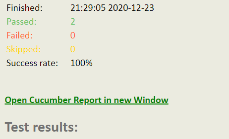
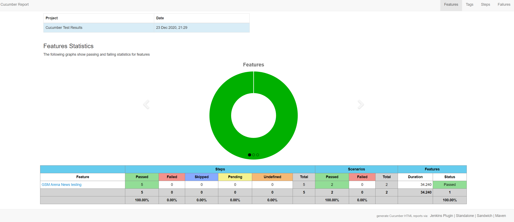

Carina allows you to integrate BDD approach into your test project easily.
Under the hood it uses popular BDD framework Cucumber extending its basic functionality and integrating cool test reports.
To integrate carina-cucumber functionality you just need to add its library into your project.
For instance with maven that can be done by adding next lines into your pom.xml:
```xml
<dependency>
    <groupId>com.zebrunner</groupId>
    <artifactId>carina-cucumber</artifactId>
    <version>${carina-cucumber_version}</version>
</dependency>
```

### Setting up cucumber test with carina

In order to automate your test on cucumber you'll need to implement couple of things:

1. Write down text of your scenario using cucumber syntax
2. Declare each step of your scenario in Jave сode
3. Map text representation of scenario with Java classes describing it

Carina supports Gherkin syntax for describing of test scenarios. More details on syntax can be found [here](https://cucumber.io/docs/gherkin/reference/).

Example of such scenario:
```
Feature: GSM Arena News testing
  In order to use Cucumber in my project, I want to check how to test GSM Arena News page

  @demo
  Scenario: GSM Arena open page - original
    Given I am on main page
    When I open 'News' page
    Then page 'News' should be open
    And page 'News' should contains all items
```
File should be stored in _test/java/resources/features/_ package and have .feature extension.

To declare steps in Java you need to use cucumber annotations **@Given, @When, @Then,** etc.   
More details on all possible annotations could be found in official cucumber [documentation](https://cucumber.io/docs/cucumber/).   
>In case if some steps declaration is missing you'll get informative error in your console when you run the test.   

If you need to operate with WebDriver instance within the class where you're declaring Java methods for you steps you can use `IDriverPool` class of carina.   
Example:
```
public class GSMArenaNewsSteps implements IDriverPool {
    
    @Given("^I am on main page")
    public boolean iAmOnMainPage() {
        HomePage homePage = new HomePage(getDriver());
        homePage.open();
        return homePage.isPageOpened();
    }
}
```

Finally, to map text steps with Java declaration you need to create test class and extend it from **CucumberBaseTest** carina class.
Then use **@CucumberOptions** annotation in order to complete the mapping itself.
Class body can be empty since all logic for buildind of scripts and running them is implemented inside CucumberBaseTest class.   
Here is the sample of such code:
```
@CucumberOptions(features = "src/test/resources/features/GSMArenaNews.feature", 
        glue = "com.zebrunner.carina.demo.cucumber.steps",
        plugin = {"pretty",
                "html:target/cucumber-core-test-report",
                "pretty:target/cucumber-core-test-report.txt",
                "json:target/cucumber-core-test-report.json",
                "junit:target/cucumber-core-test-report.xml"}
)
public class CucumberWebSampleTest extends CucumberBaseTest {}
```

### Cucumber report

In addition to default integration of your cucumber tests with Zebrunner reporting tool you can get extended cucumber report available by default.
It's getting generated automatically once test is done (in case if you enabled json reporting for your test by `"json:target/some-report-name.json"` plugin)   
Then after report being generated the link to it will be added to your emailable HTML report generated by Carina:
   
   

To get this link valid you'll need to secify proper path to your report folder using `report_url` carina  config property. In case of local run it should refer to your local report folder.   
Here is the sample of the report:



### Parallel execution

You can execute cucumber tests in parallel. You can control it by `data-provider-thread-count` property from carina properties list.   
The value of that parameter will define maximum amount of parallel threads for your cucumber tests.
