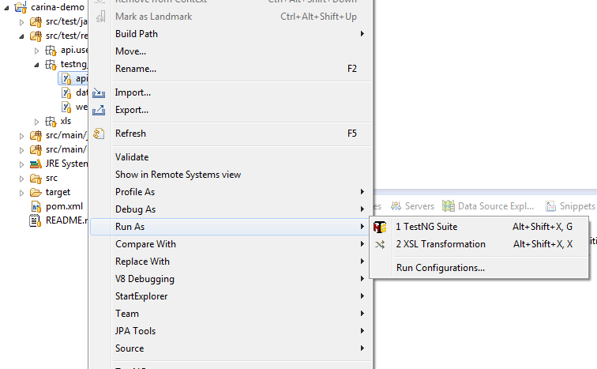

### Selenium server

[](https://youtu.be/YGXsVoEY74M)

Before running any web test, you have to start Selenium server locally or use a remote Selenium server. You may download the latest version of Selenium standalone server on [the official website](https://www.seleniumhq.org/download) along with a browser binary for Chrome, Firefox, IE, etc. For running a test with Chrome browser, you will need to download chromedriver and place it along with selenium-standalone-server-X.jar and execute (make sure that you replace 'X' by the current Selenium version):
```
java -jar -Dwebdriver.chrome.driver=./chromedriver selenium-server-standalone-X.jar
```
You have several options to run [Selenium in Docker](https://github.com/SeleniumHQ/docker-selenium), the easiest way is to create docker-compose.yml:
```
# To execute this docker-compose yml file, use docker-compose -f <file_name> up
# Add the "-d" flag at the end for deattached execution
version: '2'
services:
  firefox:
    image: selenium/node-firefox:3.11.0-californium
    volumes:
      - /dev/shm:/dev/shm
    depends_on:
      - hub
    environment:
      HUB_HOST: hub

  chrome:
    image: selenium/node-chrome:3.11.0-californium
    volumes:
      - /dev/shm:/dev/shm
    depends_on:
      - hub
    environment:
      HUB_HOST: hub

  hub:
    image: selenium/hub:3.11.0-californium
    ports:
      - "4444:4444"
```
Now you may start Selenium, running the following command in terminal:
```
docker-compose up
```

### Running tests

[](https://youtu.be/QGHCezE-d-I)

There are several options to execute a test: you may run test suite from Eclipse IDE or initiate test execution from the console using Maven Surefire plugin built into Carina framework.

To run test suite from Eclipse IDE, just select the required TestNG xml file: Right click > Run As > TestNG suite




To run the same test suite from the console, navigate to the test project root (where pom.xml is located) and execute the following command:

```
mvn clean -Dsuite=api test
```
