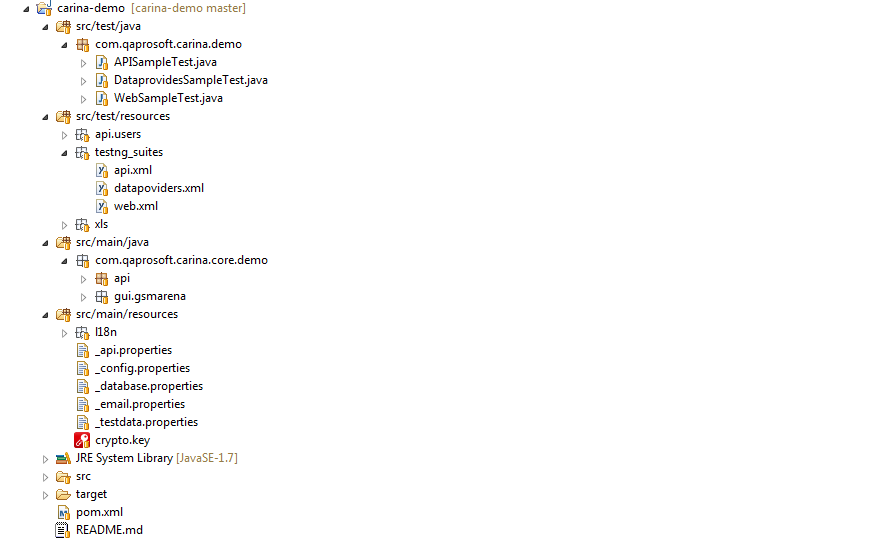

* Install and configure JDK 11+
* Install and configure [Apache Maven 3.6.0+](http://maven.apache.org/)
* Download the latest version of [Eclipse](http://www.eclipse.org/downloads/) and install [TestNG plugin](http://testng.org/doc/download.html), maven-dependency-plugin connector and optionally lombok

### Generating project
The easiest way to initialize a new project is to use Carina archetype, you will get correct project structure along with test samples. Run below command from any <b>empty folder</b>:
```
mvn archetype:generate -DarchetypeGroupId=com.zebrunner \
                       -DarchetypeArtifactId=carina-archetype \
                       -DarchetypeVersion=RELEASE \
                       -DgroupId=<your_groupId> \
                       -DartifactId=<your_artifactId> \
                       -Dname="<you_project_name>" \
                       -Durl=<your_project_url> \
                       -Dversion=<your_project_version>
```
If any attribute contains spaces, it should be set in quotes (e.g.: -Dname="Hello World"). In the above Maven command you need to specify 5 attributes, while the first 3 should be left unchanged:

<table>
	<tr>
		<th>Attribute</th>
		<th>Meaning</th>
		<th>Example</th>
	</tr>
	<tr>
		<td>-DgroupId</td>
		<td>Company domain in reverse order</td>
		<td>com.mycompany</td>
	</tr>
	<tr>
		<td>-DartifactId</td>
		<td>Java project name</td>
		<td>project-qa</td>
	</tr>
	<tr>
		<td>-Dname</td>
		<td>Name with more details</td>
		<td>"Test Automation Project"</td>
	</tr>
	<tr>
		<td>-Durl</td>
		<td>Company URL</td>
		<td>http://mycompany.com</td>
	</tr>
	<tr>
		<td>-Dversion</td>
		<td>Project version</td>
		<td>1.0</td>
	</tr>
</table>

> To generate Cucumber Demo project use `-DarchetypeArtifactId=carina-cucumber-archetype` in above maven command.

### Import to Eclipse
If the generation is successfully complete, you will see a new project folder with a name equal to the artifactId attribute specified during the generation, so navigate to this folder (where pom.xml is located) and execute the following Maven task:
```
mvn clean eclipse:eclipse
```
By executing this command, Maven should resolve all dependencies, downloading the required libraries to your local repository and generating the Eclipse classpath. Before importing a new project to Eclipse, you should link your IDE to your Maven repository by executing the following task:
```
mvn -Declipse.workspace=<path_to_workspace> eclipse:configure-workspace
```
Here you need to specify the absolute path to the Eclipse workspace. After that, restart Eclipse IDE. Now you can import generated projects such as "Existing Java Project" into Eclipse IDE.


