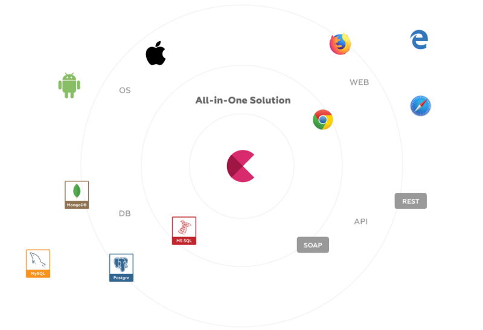
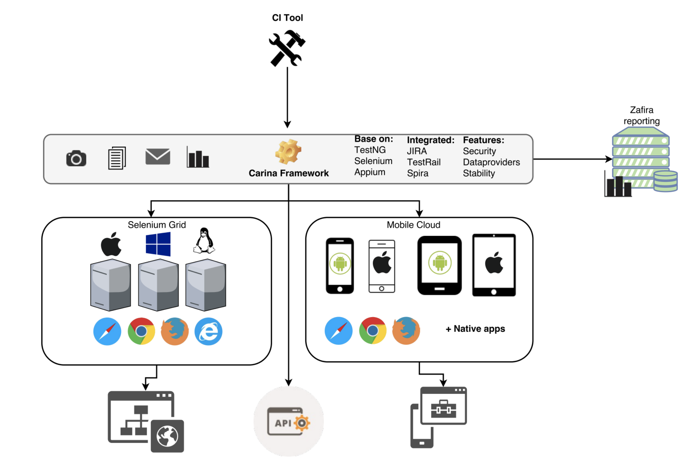

# Overview

{ width="600" }

Carina is a Java-based test automation framework that unites all testing layers: Mobile applications (web, native, hybrid), WEB applications, REST services, Databases.

<figure markdown>
<B>[TRY DEMO PROJECT NOW](https://github.com/zebrunner/carina-demo)</B>
</figure>

* Carina Framework is built on top of the most popular open-source solutions like Selenium, Appium, TestNG allowing to reduce dependence on the specific technology stack.

* Carina supports all popular browsers (Edge, Safari, Chrome, Firefox) and mobile devices (iOS/Android). A special feature for a mobile domain: it reuses test automation code between IOS/Android up to 70-80%.

* Carina is cross-platform. Tests may be easily executed both on Unix or Windows OS. All you need is JDK 11 installed.

* The framework supports different types of databases - both relational and non-relational (MySQL, SQL Server, Oracle, PostgreSQL), providing amazing experience of DAO layer implementation using MyBatis ORM framework.

* API testing is based on a Freemarker template engine. It enables great flexibility in generating REST requests, and responses are dynamically changed by incoming arguments.

Carina is fully integrated into [Zebrunner](https://zebrunner.com) that helps to setup a production-ready environment for running Mobile, Web and API tests. Feel free to ask any questions if you are going to use it in your company.

