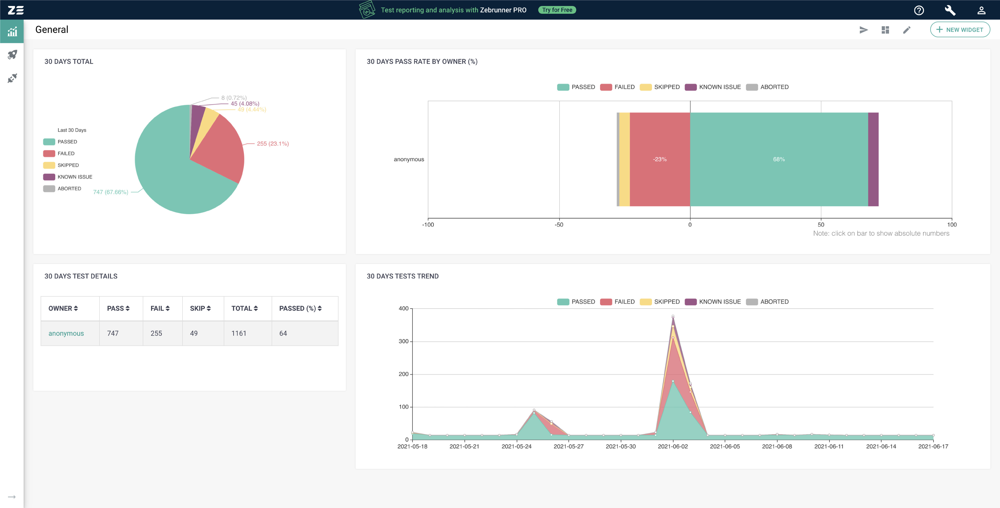
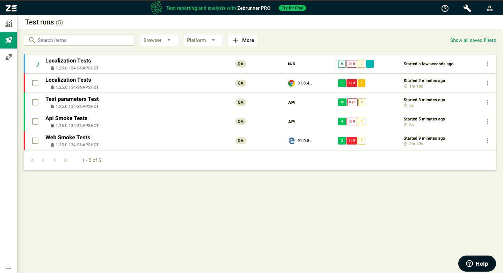
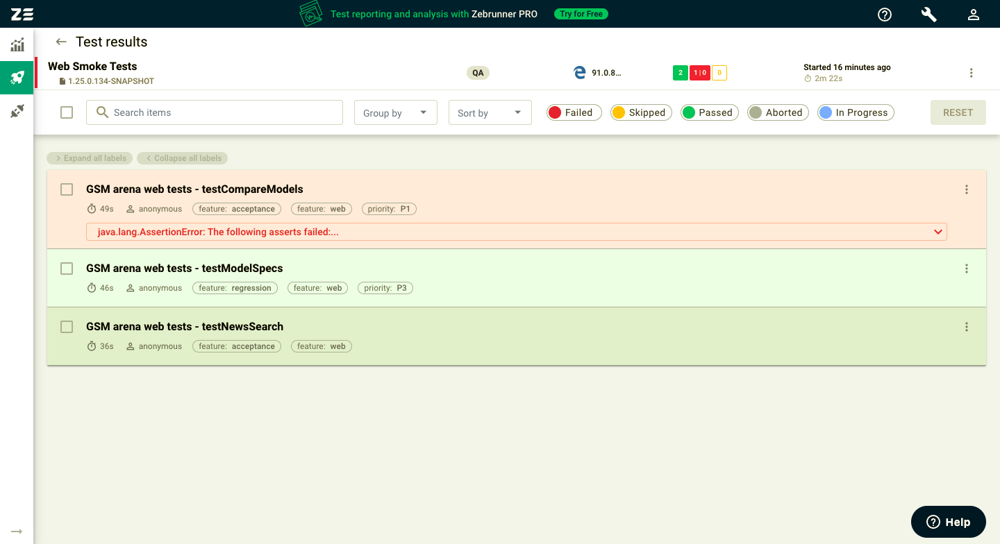
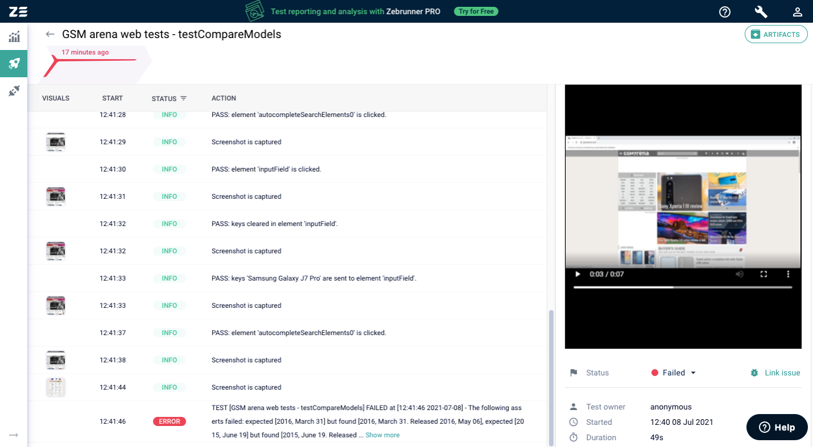

#Zebrunner Reporting Integration

[](https://zebrunner.com/)

**Integrating the Carina framework with Zebrunner is easy!**

Before the start, make sure you have [Zebrunner PRO](https://zebrunner.com/) organization tenant or [Zebrunner Community Edition](https://github.com/zebrunner/community-edition) installed.
Let’s begin the integration!



###Create agent.properties file

Navigate to the folder `src/main/resources` and create agent.properties file (if not already created).

###Configure agent parameters
Declare integration parameters in agent.properties:

```
reporting.enabled=true
reporting.server.hostname=https://bestcompany.zebrunner.com
reporting.server.access-token=c4OXu6ch8KI3rkYraZiaDrRB7kCIndfadHSmltgVFjBiAx5LcK
reporting.run.display-name=Localization Tests
reporting.run.build=1.15.0.134-SNAPSHOT
reporting.run.environment=QA
```
Possible parameters in agent.properties:

- `reporting.enabled` - enables or disables reporting. The default value is false. If disabled, the agent will use no op component implementations that will simply log output for tracing purposes with the trace level;
- `reporting.server.hostname` - mandatory if reporting is enabled. Zebrunner server hostname. Can be obtained in Zebrunner on the 'Account & Profile' page under the 'Service URL' section;
- `reporting.server.access-token` - mandatory if reporting is enabled. Access token must be used to perform API calls. Can be obtained in Zebrunner on the 'Account & profile' page under the 'Token' section;
- `reporting.run.display-name` - optional value. The display name of the test run. The default value is Default Suite;
- `reporting.run.build` - optional value. The build number that is associated with the test run. It can depict either the test build number or the application build number;
- `reporting.run.environment` - optional value. The environment in which the tests will run.

More details and examples of Environment variables, Program arguments, etc. can be found in the 
[Documentation](https://zebrunner.com/documentation/reporting/carina-testng/). 

###The integration is in place!

**Now you can:**

* Report tests from Carina based project into Zebrunner



* Track test results in real-time



* Perform smart test analysis with logs, videos and screenshots


  
* Create quality trends’ reports with dozens of metrics


Join us in our support [Telegram channel](https://t.me/zebrunner)
for more updates in Carina and Zebrunner!

Want to get the advanced test execution and reporting for your testing? Sign up for a FREE 14-day trial in
[Zebrunner PRO](https://zebrunner.com/).
