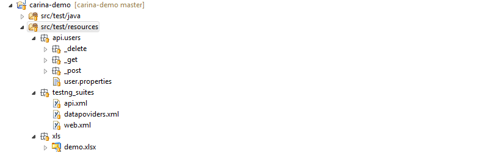
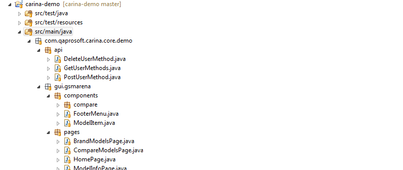
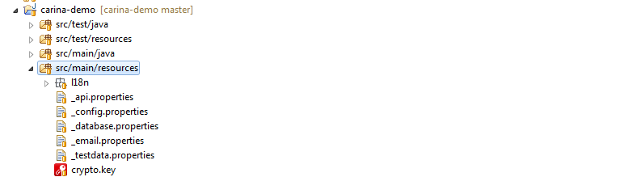

Carina test project is structured as a standard Maven project:
```
carina-demo
|-- pom.xml
|-- src/test/java        
|-- src/test/resources
    |-- api
    |-- testng_suites
    |-- xls
|-- src/main/java
|-- src/main/resources
    |-- L10N
```

* **src/test/java** - contains test classes organized using TestNG annotations


* **src/test/resources** - contains TestNG xml files, API templates and XLS/CSV data providers, etc.



* **src/main/java** - contains page object classes, API domains and additional utilities



* **src/main/resources** - contains L10N resources, configuration properties files and MyBatis profiles if needed


