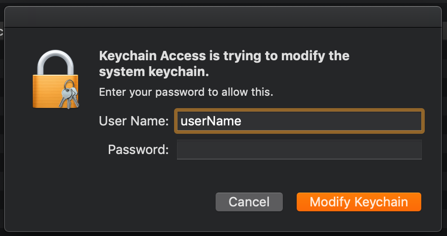
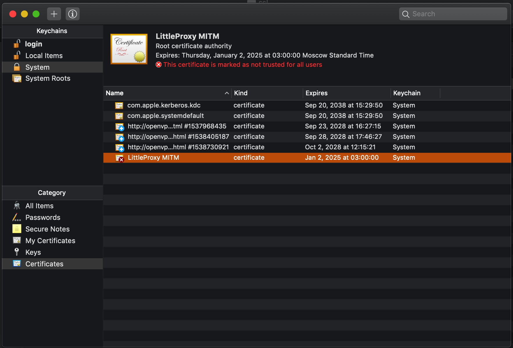
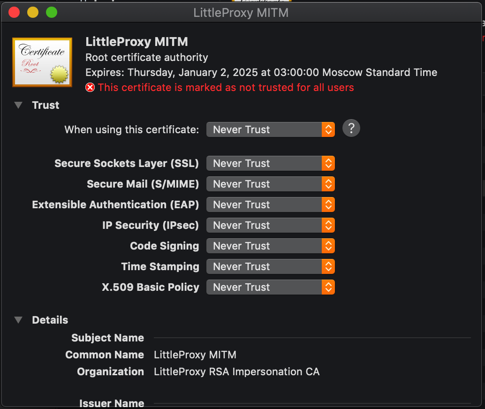

### Operating with Proxies
There is a possibility to send all test traffic via proxy including the embedded light-weight BrowserMob proxy server.
There are several properties available to manage all kinds of proxy usage:
```
proxy_host=NULL
proxy_port=NULL
proxy_protocols=http,https,ftp
proxy_set_to_system=true
browsermob_proxy=false
browsermob_disabled_mitm=false
browsermob_port=0
```
Declare proxy_host, proxy_port and proxy_protocols to send all Web and API test traffic via your static network proxy.
Also, to enable proxy for TestNG Java process, **proxy_set_to_system** must be specifed to **true**, otherwise only WebDrivers and API clients will be proxied.

Note: The above settings are mostly required to get public internet access through corporate proxies.

### Raising inbuilt proxy-server (BrowserMob)
Also, Carina can start an embedded proxy to proxy/view/filter requests/responses. There is an inbuilt library BrowserMobProxy in Carina-proxy module. Below you can find BrowserMob proxy related parameters in your **config.properties** file:
```
browsermob_proxy=true
browsermob_disabled_mitm=false
browsermob_port=0
browsermob_ports_range=NULL
```
With the enabled **browsermob_proxy**, Carina will start the dedicated proxy instance on every test method. 

Carina automatically detects an IP address for your local browsermob proxy and puts it into the capabilities in case if **proxy_host=NULL**. If you want to map some publicly available IP address for your browsermob proxy instance then you'll need to override it via **proxy_host** property.
E.g. **proxy_host=myhostname** is useful in case of running maven process inside a docker container. Override the hostname, and it will be available from Selenium instance.

**browsermob_port=0** means that Carina dynamically identifies a free port for a proxy session.

**browsermob_ports_range=8001:8003** means that Carina will use only ports from given range for starting of browsermob sessions. That's reasonable for cases when only several ports are shared at environment and can be accessed from other machines within the network. If all ports are used then test will wait for the first freed port.

**browsermob_disabled_mitm** is disabled by default. 

**Important!** If you have troubles with  SSL traffic sniffing, the first thing you should do is to change **browsermob_disabled_mitm** property value!

#### Using proxy-server in Java code:

1. Make sure the driver instance is already started:
```
getDriver();
```
Note: During the driver startup, Carina automatically starts proxy and adjusts browser capabilities to track the desired protocols. To get proxy instance for the current test/thread, you can call:
```
BrowserMobProxy proxy = ProxyPool.getProxy();
```
2. Enable the required Har capture type using:
```
proxy.enableHarCaptureTypes(CaptureType.REQUEST_CONTENT, CaptureType.RESPONSE_CONTENT);
```
There are a lot of possible content types:
```
CaptureType.RESPONSE_COOKIES
CaptureType.RESPONSE_HEADERS
CaptureType.REQUEST_HEADERS
CaptureType.RESPONSE_CONTENT
CaptureType.REQUEST_CONTENT
...
```
They all can be set as comma-separated parameters.

4. You may want to save the captured content into a .har file:
```
proxy.newHar(HAR_NAME);

//Some testing activity...

//Saving har to a file...
File file = new File(HAR_NAME + ".har");
Assert.assertNotNull(proxy.getHar(), "Har is NULL!");

try {
    proxy.getHar().writeTo(file);
} catch (IOException e) {
    e.printStackTrace();
}
```
Your .har file will be created in the project root folder

5. There are four methods to support request and response interception:

* addRequestFilter
* addResponseFilter
* addFirstHttpFilterFactory
* addLastHttpFilterFactory

To add and configure content filters, look [here](https://github.com/lightbody/browsermob-proxy#http-request-manipulation).

#### Dealing with MITM and installing SSL certificate into your system:

##### For Mac users:

1. Go [here](https://github.com/lightbody/browsermob-proxy/blob/master/browsermob-core/src/main/resources/sslSupport/ca-certificate-rsa.cer) and save it as **ca-certificate-rsa.cer**.
2. A double click creates a file. The next window should appear:



3. After authorization, the certificate will be added into your system certificates,  but it's still untrusted:



4. To make it trusted, double click on it. The following window should appear:



5. First, click the drop-down menu and select **Always Trust** option. Then close the window (a second authorization will be required):


6. Make sure the red cross on your certificate turned into a blue one:


#### Adding SSL certificate into Java keystore:

If you are still receiving the following exception:
```
javax.net.ssl.SSLHandshakeException: sun.security.validator.ValidatorException: PKIX path building failed: sun.security.provider.certpath.SunCertPathBuilderException: unable to find valid certification path to requested target
```
you may need to set up **ca-certificate-rsa.cer** into your Java keystore.

##### For Mac and Linux users:

```
sudo keytool -importcert -alias browsermob -file pathToYourCertificateLocation/BrowserMobCertificate.crt -keystore /Library/Java/JavaVirtualMachines/jdk1.8.0_181.jdk/Contents/Home/jre/lib/security/cacerts
```
You will be asked to enter your Mac profile password and a Java keystore password (by default: changeit).
