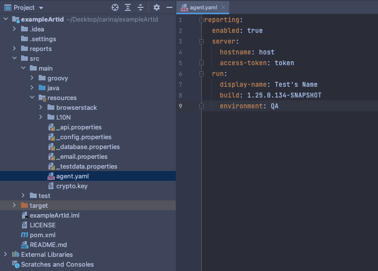

#How to integrate Carina Framework with Zebrunner Community Edition

[](https://www.qps-infra.io/)

**Integrating the Carina framework with Zebrunner Community Edition is easy!**

Before the start, make sure you have [Zebrunner Community Edition](https://github.com/zebrunner/zebrunner)
installed together with the [Reporting service](https://github.com/zebrunner/reporting). If you haven’t yet used Zebrunner CE, 
follow the [User Guide](https://zebrunner.github.io/zebrunner/) with the steps on installation and configuration. 
Let’s begin the integration!


> **Note** : If you already use the Carina framework in your testing, you can skip Steps 1-2 and begin with Step 3. 

###Step 1. Generate the carina-demo project

Learn how to generate the carina-demo project in the [User Guide](https://zebrunner.github.io/carina/getting_started/).

> **Note**: If you already have a carina-demo based project, then update to the latest [carina-core](https://github.com/zebrunner/carina/releases) version.
###Step 2. Generate Zebrunner agent

If the generation is completed successfully, you will see a new project folder with a name equal to the artifactId attribute specified during the generation, so navigate to this folder (where pom.xml is located) and execute the following Maven task:

```
mvn clean compile
```

After executing this command, the Zebrunner agent will be generated.

>**Note**: In case you start running tests without executing this command, you’ll get the following message: Error opening zip file or JAR manifest missing : /Users/…/carina-demo/target/agent/zebrunner-agent.jar

###Step 3. Create agent.yaml or agent.properties file

Navigate to the folder `src/main/resources` and create agent.yaml or agent.properties file (if not already created).


###Step 4. Configure Zebrunner agent
In this example, let’s perform the configuration on the basis of file extension YAML.

Below is a sample configuration file:

```
reporting:
    enabled: true
    server:
        hostname: localhost:8080
        access-token: <token>
    run:
        display-name: Nightly Regression Suite
        build: 1.12.1.96-SNAPSHOT
        environment: DEV
```
Possible parameters in agent.yaml:

- `reporting.enabled` - enables or disables reporting. The default value is false. If disabled, the agent will use no op component implementations that will simply log output for tracing purposes with the trace level;
- `reporting.server.hostname` - mandatory if reporting is enabled. Zebrunner server hostname. Can be obtained in Zebrunner on the 'Account & profile' page under the 'Service URL' section;
- `reporting.server.access-token` - mandatory if reporting is enabled. Access token must be used to perform API calls. Can be obtained in Zebrunner on the 'Account & profile' page under the 'Token' section;
- `reporting.run.display-name` - optional value. The display name of the test run. The default value is Default Suite;
- `reporting.run.build` - optional value. The build number that is associated with the test run. It can depict either the test build number or the application build number;
- `reporting.run.environment` - optional value. The environment in which the tests will run.




More details and examples of Environment variables, Program arguments, Properties file can be found in the 
[Documentation](https://zebrunner.com/documentation/agents/testng) in the section ‘Tracking of test results’. 

###The integration with Zebrunner is in place!

**Now you can:**

* Report tests from Carina into Zebrunner CE


* Track test results in real-time


* Perform smart test analysis with logs, videos and screenshots


  
* Create quality trends’ reports with dozens of metrics


Join us in our support [Telegram channel](https://t.me/zebrunner)
for more updates in Carina and Zebrunner Community Edition!

Want to get the advanced test execution and reporting for your testing? Sign up for a FREE 30-day trial in
[Zebrunner PRO](https://zebrunner.com/).
